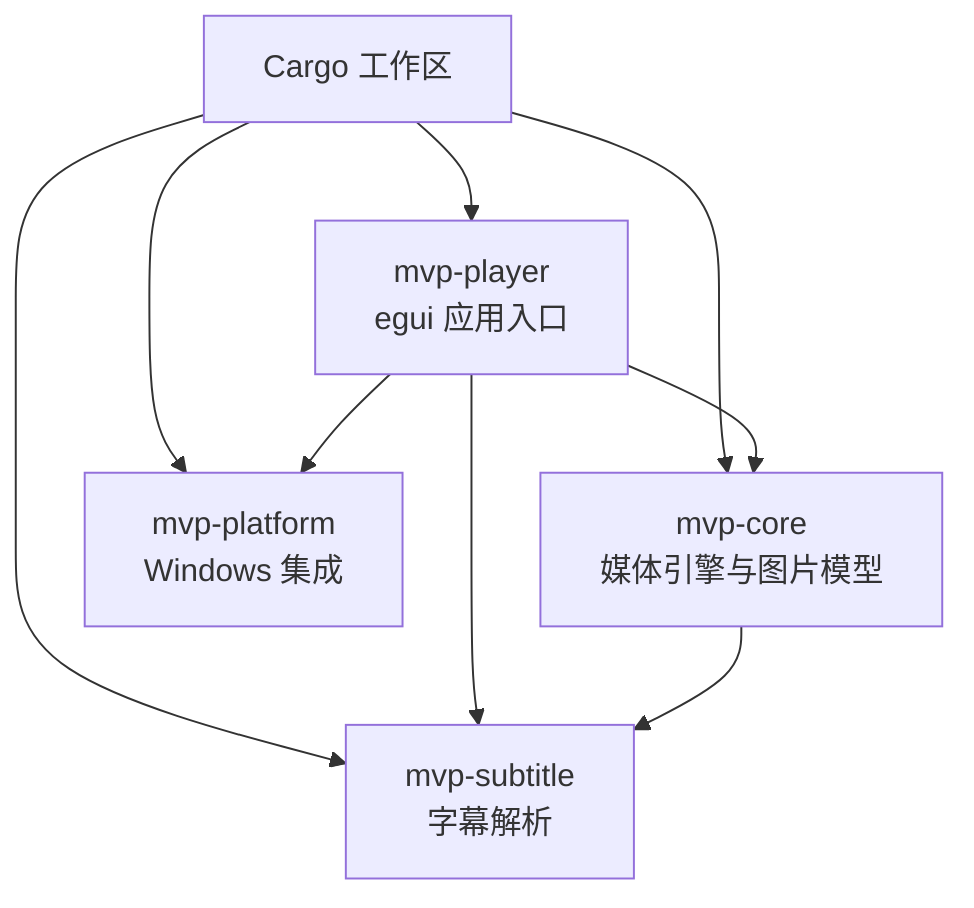
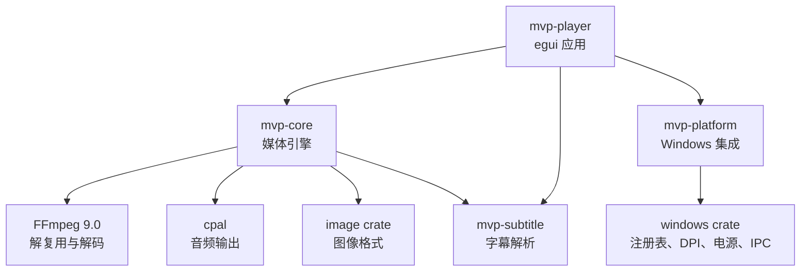
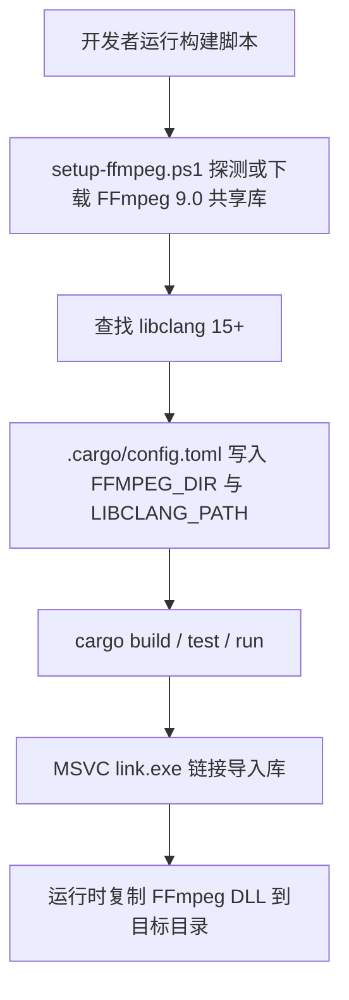
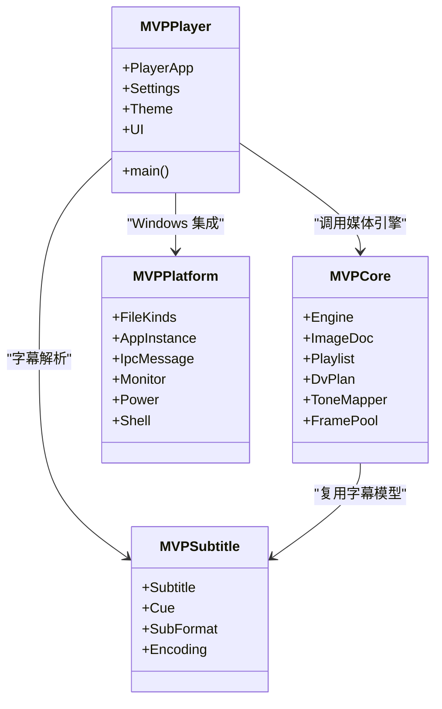
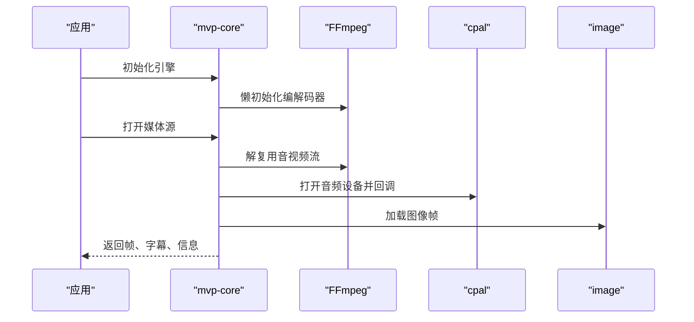
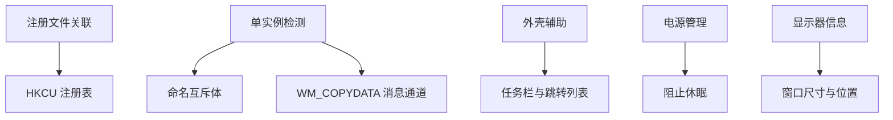
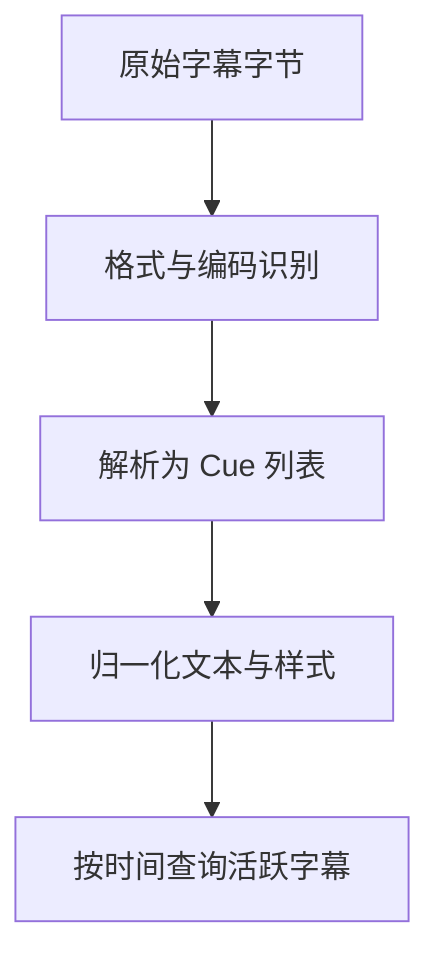
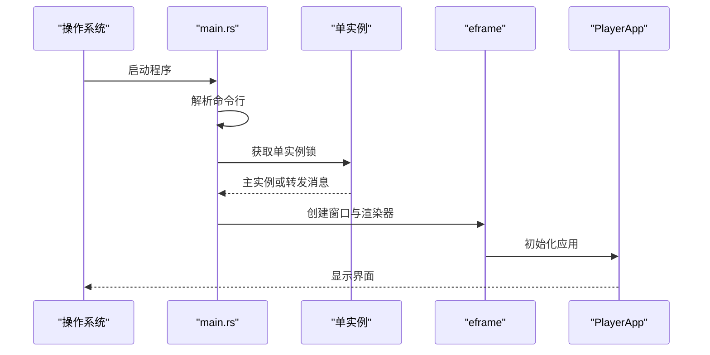
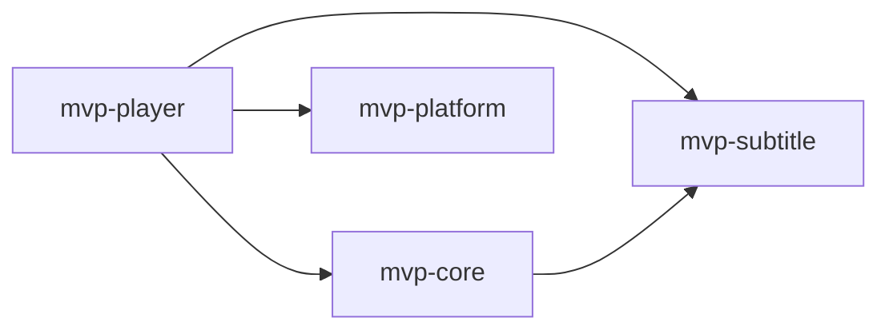
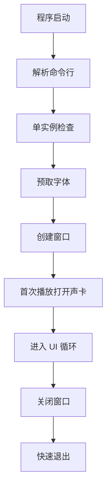

# 技术栈概览

<cite>
**本文引用的文件**   
- [Cargo.toml](file://Cargo.toml)
- [README.md](file://README.md)
- [mvp-core/Cargo.toml](file://crates/mvp-core/Cargo.toml)
- [mvp-core/src/lib.rs](file://crates/mvp-core/src/lib.rs)
- [mvp-platform/Cargo.toml](file://crates/mvp-platform/Cargo.toml)
- [mvp-platform/src/lib.rs](file://crates/mvp-platform/src/lib.rs)
- [mvp-platform/src/assoc.rs](file://crates/mvp-platform/src/assoc.rs)
- [mvp-subtitle/Cargo.toml](file://crates/mvp-subtitle/Cargo.toml)
- [mvp-subtitle/src/lib.rs](file://crates/mvp-subtitle/src/lib.rs)
- [mvp-player/Cargo.toml](file://crates/mvp-player/Cargo.toml)
- [mvp-player/src/main.rs](file://crates/mvp-player/src/main.rs)
- [scripts/setup-ffmpeg.ps1](file://scripts/setup-ffmpeg.ps1)
</cite>

## 目录
1. [引言](#引言)
2. [项目结构](#项目结构)
3. [核心技术选型与协作关系](#核心技术选型与协作关系)
4. [构建工具链与依赖管理](#构建工具链与依赖管理)
5. [工作区与多 crate 架构](#工作区与多-crate-架构)
6. [核心组件技术分析](#核心组件技术分析)
7. [依赖关系图](#依赖关系图)
8. [性能与启动特性](#性能与启动特性)
9. [常见问题与排错](#常见问题与排错)
10. [结论](#结论)

## 引言
MVP-Versatile-Player 是一个面向 Windows 的多功能音视频与图片播放器。它以 Rust 为主要语言，直接链接 FFmpeg 作为媒体编解码内核，使用 egui/eframe 提供图形界面，通过 cpal 输出音频，用 image crate 处理图像格式，并通过 windows crate 完成 Windows 系统集成。项目的目标是实现接近 VLC/PotPlayer 的使用体验，同时强调启动速度、错误可见性、字幕与 HDR 支持，以及可维护的模块化架构。

## 项目结构
仓库采用 Cargo workspace 组织四个主要 crate：
- mvp-core：媒体引擎、FFmpeg 绑定、播放列表、图片查看模型、杜比视界与 HDR 处理。
- mvp-platform：Windows 集成，包括文件关联、单实例 IPC、外壳辅助、电源管理与显示器信息。
- mvp-subtitle：纯逻辑字幕解析与时间查询，不依赖 FFmpeg 或平台 API。
- mvp-player：egui 应用入口、窗口与 UI 层，负责命令行、日志、主题、设置与界面交互。

**图表来源**
- [Cargo.toml:1-8](file://Cargo.toml#L1-L8)
- [README.md:315-323](file://README.md#L315-L323)

**章节来源**
- [Cargo.toml:1-8](file://Cargo.toml#L1-L8)
- [README.md:315-323](file://README.md#L315-L323)

## 核心技术选型与协作关系
项目选择的技术栈围绕“稳定、高性能、可验证、可调试”展开：

| 技术 | 版本或范围 | 角色 | 选择原因 |
|---|---:|---|---|
| Rust | 1.85+ | 主要编程语言 | 内存安全、并发模型清晰、适合媒体管线与系统级开发；workspace 统一版本与发布配置。 |
| FFmpeg | 9.0（共享库） | 解复用、视频/音频解码、色彩与元数据读取 | 成熟的多格式支持；直接链接避免子进程与管道预热延迟。 |
| ffmpeg-next | 9.0.0 | Rust 对 FFmpeg 的 FFI 绑定 | 与 FFmpeg 9.0 发行分支对齐，避免 master 分支中尚未被绑定识别的新枚举导致编译失败。 |
| egui / eframe | 0.32 | GUI 框架与原生窗口 | eframe 提供 winit 窗口、Glow 渲染；egui 提供即时模式 UI，适合快速迭代与轻量界面。 |
| cpal | 0.16 | 音频输出 | 跨平台音频后端，用于在回调线程内执行音效增强并控制声卡缓冲。 |
| image | 0.25 | 图像格式处理 | 支持 PNG/JPEG/GIF/WebP/BMP/TIFF/ICO/TGA/AVIF/JXL/QOI/EXR 等格式，配合 EXIF 方向与动画帧。 |
| windows | 0.62 | Windows 平台 API 绑定 | 文件关联、注册表、DPI、任务栏、电源状态、单实例 IPC 等系统集成能力。 |
| rfd | 0.15 | 文件对话框 | 提供跨平台文件选择，启用 xdg-portal 与 tokio 以适配现代桌面环境。 |
| raw-window-handle | 0.6 | 窗口句柄桥接 | 将 eframe/winit 窗口交给 OpenGL/Glow 渲染路径。 |

这些技术之间的协作关系如下：

**图表来源**
- [mvp-player/Cargo.toml:13-34](file://crates/mvp-player/Cargo.toml#L13-L34)
- [mvp-core/Cargo.toml:8-25](file://crates/mvp-core/Cargo.toml#L8-L25)
- [mvp-platform/Cargo.toml:8-39](file://crates/mvp-platform/Cargo.toml#L8-L39)
- [README.md:23-124](file://README.md#L23-L124)

**章节来源**
- [Cargo.toml:17-51](file://Cargo.toml#L17-L51)
- [README.md:23-124](file://README.md#L23-L124)

## 构建工具链与依赖管理
### 构建要求
- Rust 工具链：`x86_64-pc-windows-msvc`，最低版本 1.85。
- MSVC 生成工具：VS 2022，需要 `link.exe` 与 Windows SDK。
- FFmpeg 开发包：9.0 共享库构建，包含 `include/`、`lib/*.lib`、`bin/*.dll`。
- libclang：任意 15+，用于 `ffmpeg-sys-next` 的 bindgen 阶段生成绑定。

### 依赖管理方式
- 工作区根 `Cargo.toml` 集中声明公共依赖、FFmpeg、GUI、媒体与平台相关 crate 的版本。
- 各 crate 通过 `workspace.dependencies` 引用统一版本，避免版本漂移。
- FFmpeg 与 libclang 的路径由脚本写入本机 `.cargo/config.toml`，该文件不被纳入版本控制。
- 发布构建开启 LTO、strip、优化等级提升，兼顾启动速度与二进制体积。

**图表来源**
- [scripts/setup-ffmpeg.ps1:1-22](file://scripts/setup-ffmpeg.ps1#L1-L22)
- [scripts/setup-ffmpeg.ps1:152-200](file://scripts/setup-ffmpeg.ps1#L152-L200)
- [README.md:153-253](file://README.md#L153-L253)

**章节来源**
- [README.md:153-253](file://README.md#L153-L253)
- [scripts/setup-ffmpeg.ps1:1-22](file://scripts/setup-ffmpeg.ps1#L1-L22)
- [scripts/setup-ffmpeg.ps1:152-200](file://scripts/setup-ffmpeg.ps1#L152-L200)

## 工作区与多 crate 架构
Cargo workspace 定义了四个成员 crate，每个 crate 职责清晰、依赖边界明确：

| Crate | 主要职责 | 关键技术选型 | 设计考虑 |
|---|---|---|---|
| mvp-core | 媒体引擎、FFmpeg 绑定、播放列表、图片查看器、杜比视界与 HDR | ffmpeg-next、cpal、image、serde、parking_lot、crossbeam-channel | 直接链接 FFmpeg，避免子进程；队列按字节上限；工作线程捕获 panic；时钟基于系统时钟。 |
| mvp-platform | Windows 系统集成 | windows crate、serde（可选） | 仅写 HKCU，无需管理员权限；单实例命名互斥体 + WM_COPYDATA；DPI 与工作区测量。 |
| mvp-subtitle | 字幕解析与时间查询 | encoding_rs、once_cell | 纯逻辑无平台依赖；SRT/ASS/VTT/MicroDvd；编码自动识别；健壮降级。 |
| mvp-player | egui 应用入口、UI、设置、主题、命令与日志 | eframe、egui、rfd、raw-window-handle、embed-resource | 启动前只做必要初始化；窗口与 GL 上下文创建交给 eframe；图标代码绘制避免启动时解码资源。 |

**图表来源**
- [mvp-core/src/lib.rs:19-46](file://crates/mvp-core/src/lib.rs#L19-L46)
- [mvp-platform/src/lib.rs:23-34](file://crates/mvp-platform/src/lib.rs#L23-L34)
- [mvp-subtitle/src/lib.rs:47-59](file://crates/mvp-subtitle/src/lib.rs#L47-L59)
- [mvp-player/src/main.rs:19-29](file://crates/mvp-player/src/main.rs#L19-L29)

**章节来源**
- [Cargo.toml:1-8](file://Cargo.toml#L1-L8)
- [mvp-core/Cargo.toml:1-25](file://crates/mvp-core/Cargo.toml#L1-L25)
- [mvp-platform/Cargo.toml:1-48](file://crates/mvp-platform/Cargo.toml#L1-L48)
- [mvp-subtitle/Cargo.toml:1-11](file://crates/mvp-subtitle/Cargo.toml#L1-L11)
- [mvp-player/Cargo.toml:1-38](file://crates/mvp-player/Cargo.toml#L1-L38)

## 核心组件技术分析

### mvp-core：媒体引擎与图像处理
mvp-core 是播放器的核心，负责：
- 懒初始化 FFmpeg，仅在首次使用时注册编解码器与格式。
- 暴露 Engine、Clock、ImageDoc、Playlist、DvPlan、ToneMapper、FramePool 等关键类型。
- 通过 ffmpeg-next 直接调用 FFmpeg，避免 side-car 进程。
- 使用 cpal 进行音频输出，使用 image 处理静态与动画图像。
- 提供杜比视界与 HDR 元数据处理，包括 RPU、传输函数、亮度范围与重塑曲线。

**图表来源**
- [mvp-core/src/lib.rs:50-69](file://crates/mvp-core/src/lib.rs#L50-L69)
- [mvp-core/Cargo.toml:8-25](file://crates/mvp-core/Cargo.toml#L8-L25)

**章节来源**
- [mvp-core/src/lib.rs:1-46](file://crates/mvp-core/src/lib.rs#L1-L46)
- [mvp-core/Cargo.toml:8-25](file://crates/mvp-core/Cargo.toml#L8-L25)

### mvp-platform：Windows 系统集成
mvp-platform 封装所有 Windows 特定行为：
- 文件关联：仅写 HKCU，支持 capabilities 注册与默认应用深链。
- 单实例：命名互斥体 + 隐藏顶层窗口作为 WM_COPYDATA IPC 端点。
- 外壳辅助：AppUserModelID、深色标题栏、任务栏闪烁、Explorer 操作。
- 电源管理：播放时阻止屏幕休眠。
- 显示器信息：工作区与 DPI，确保窗口尺寸与位置合理。

**图表来源**
- [mvp-platform/src/lib.rs:1-21](file://crates/mvp-platform/src/lib.rs#L1-L21)
- [mvp-platform/src/assoc.rs:1-20](file://crates/mvp-platform/src/assoc.rs#L1-L20)

**章节来源**
- [mvp-platform/src/lib.rs:1-34](file://crates/mvp-platform/src/lib.rs#L1-L34)
- [mvp-platform/src/assoc.rs:1-20](file://crates/mvp-platform/src/assoc.rs#L1-L20)

### mvp-subtitle：字幕解析
mvp-subtitle 是纯逻辑模块，不依赖 FFmpeg 或平台 API：
- 支持 SRT、ASS/SSA、WebVTT、MicroDvd。
- 自动编码识别，兼容 UTF-8、UTF-16 BOM、GBK、Big5、Shift_JIS、Windows-1252。
- 将不同格式归一化为 Cue 模型，提供 active_at、index_at、merge_adjacent 等方法。
- 解析路径保证“从不失败”，损坏行会被跳过，不会掩盖其余内容。

**图表来源**
- [mvp-subtitle/src/lib.rs:1-43](file://crates/mvp-subtitle/src/lib.rs#L1-L43)
- [mvp-subtitle/src/lib.rs:61-200](file://crates/mvp-subtitle/src/lib.rs#L61-L200)

**章节来源**
- [mvp-subtitle/src/lib.rs:1-59](file://crates/mvp-subtitle/src/lib.rs#L1-L59)
- [mvp-subtitle/Cargo.toml:1-11](file://crates/mvp-subtitle/Cargo.toml#L1-L11)

### mvp-player：应用入口与 UI
mvp-player 是 egui 应用入口，负责：
- 解析命令行参数，支持全屏、音量、速度、外部字幕等选项。
- 单实例检测：已有实例则发送 OpenPaths 或 Activate 消息。
- 懒加载字体与日志，避免启动阻塞。
- 创建 eframe 窗口，使用 Glow 渲染器，设置最小尺寸与图标。
- 将控制权交给 PlayerApp，由 UI 层驱动媒体引擎。

**图表来源**
- [mvp-player/src/main.rs:40-181](file://crates/mvp-player/src/main.rs#L40-L181)
- [mvp-player/Cargo.toml:1-38](file://crates/mvp-player/Cargo.toml#L1-L38)

**章节来源**
- [mvp-player/src/main.rs:1-181](file://crates/mvp-player/src/main.rs#L1-L181)
- [mvp-player/Cargo.toml:1-38](file://crates/mvp-player/Cargo.toml#L1-L38)

## 依赖关系图
从 crate 依赖角度，mvp-player 是顶层可执行入口，依赖其他三个 crate；mvp-core 依赖 mvp-subtitle；mvp-platform 独立于媒体逻辑。

**图表来源**
- [mvp-player/Cargo.toml:32-34](file://crates/mvp-player/Cargo.toml#L32-L34)
- [mvp-core/Cargo.toml:22-25](file://crates/mvp-core/Cargo.toml#L22-L25)

**章节来源**
- [mvp-player/Cargo.toml:13-34](file://crates/mvp-player/Cargo.toml#L13-L34)
- [mvp-core/Cargo.toml:8-25](file://crates/mvp-core/Cargo.toml#L8-L25)

## 性能与启动特性
- 启动前只做三件事：解析命令行、写单实例互斥体、读中文字体。
- FFmpeg 表懒初始化，声卡在首次播放时才打开。
- 发布构建使用 LTO、fat codegen、strip symbols，减小二进制体积并提升启动速度。
- 关闭时不等解码积压与声卡超时，优先快速退出。
- 日志文件按运行周期轮转，避免长时间运行后日志无限增长。

**图表来源**
- [README.md:425-453](file://README.md#L425-L453)
- [mvp-player/src/main.rs:101-181](file://crates/mvp-player/src/main.rs#L101-L181)

**章节来源**
- [README.md:425-453](file://README.md#L425-L453)
- [mvp-player/src/main.rs:101-181](file://crates/mvp-player/src/main.rs#L101-L181)

## 常见问题与排错
- 找不到 libclang：`ffmpeg-sys-next` 的 bindgen 步骤需要 libclang.dll；重新运行 setup-ffmpeg.ps1 或安装 LLVM。
- 找不到 FFmpeg 开发包：确认 FFMPEG_DIR 指向包含 include/lib/bin 的共享库目录。
- 构建失败因新编解码器枚举：使用 FFmpeg 9.0 发行分支而非 master。
- 运行时缺少 FFmpeg DLL：dev 脚本会把 DLL 复制到 target 目录，或直接运行打包产物。

**章节来源**
- [README.md:191-231](file://README.md#L191-L231)
- [scripts/setup-ffmpeg.ps1:122-149](file://scripts/setup-ffmpeg.ps1#L122-L149)

## 结论
MVP-Versatile-Player 的技术栈以 Rust 为核心，结合 FFmpeg 9.0、egui/eframe、cpal、image 与 windows crate，形成清晰的四层架构：媒体引擎、平台集成、字幕解析与应用界面。工作区统一管理版本与依赖，脚本负责本机 FFmpeg 与 libclang 配置，使构建流程稳定且可重复。整体设计强调启动速度、错误可见性与可维护性，适合长期演进与扩展。