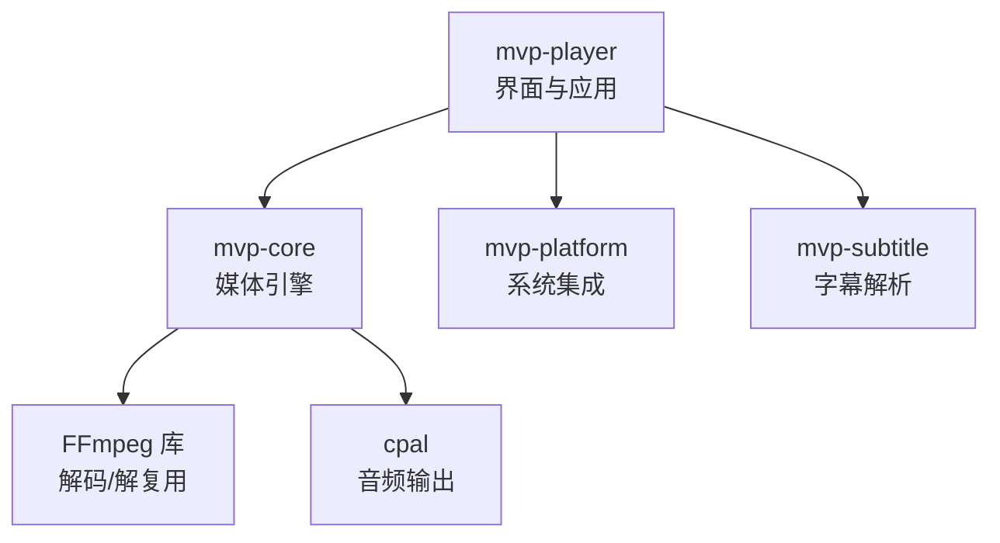
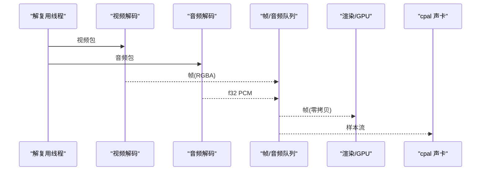
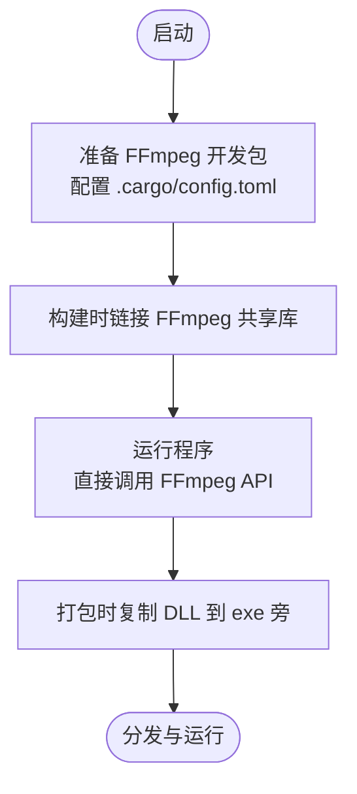
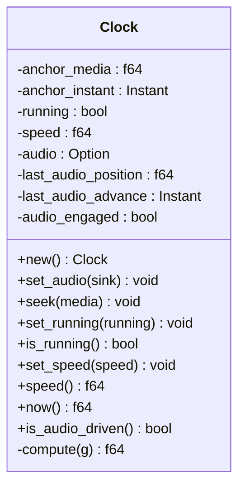
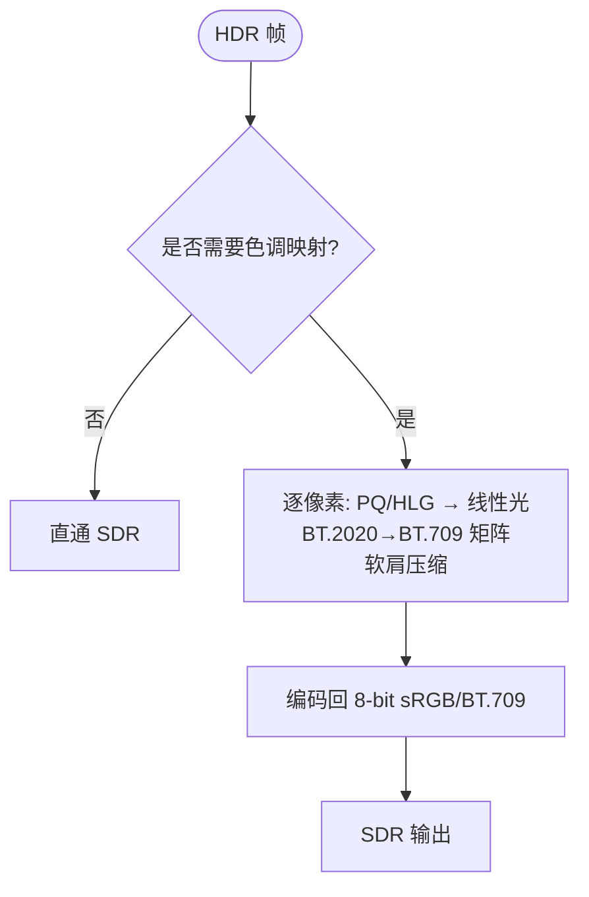
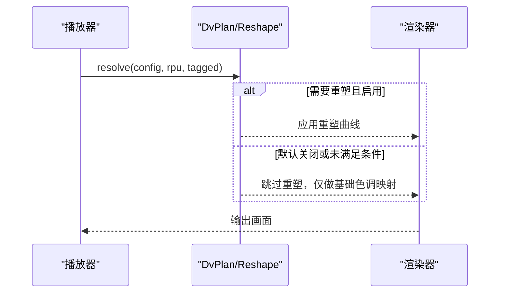
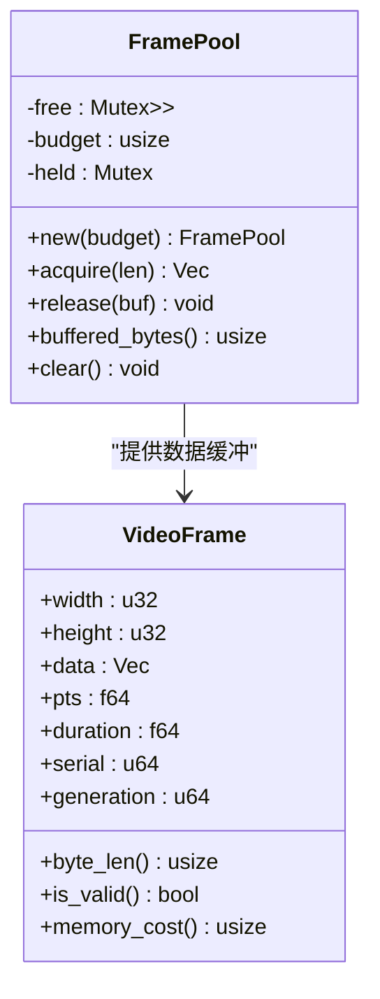
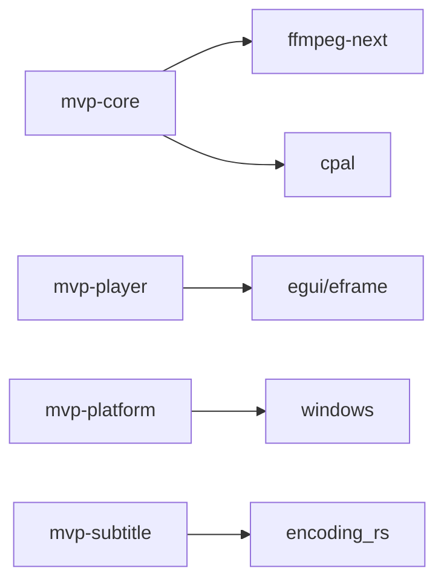

# 关键设计决策

<cite>
**本文引用的文件**
- [README.md](file://README.md)
- [Cargo.toml](file://Cargo.toml)
- [crates/mvp-core/src/engine/clock.rs](file://crates/mvp-core/src/engine/clock.rs)
- [crates/mvp-core/src/hdr.rs](file://crates/mvp-core/src/hdr.rs)
- [crates/mvp-core/src/dolby.rs](file://crates/mvp-core/src/dolby.rs)
- [crates/mvp-core/src/dolby/reshape.rs](file://crates/mvp-core/src/dolby/reshape.rs)
- [crates/mvp-core/src/video.rs](file://crates/mvp-core/src/video.rs)
- [scripts/setup-ffmpeg.ps1](file://scripts/setup-ffmpeg.ps1)
</cite>

## 目录
1. [引言](#引言)
2. [项目结构](#项目结构)
3. [核心组件](#核心组件)
4. [架构总览](#架构总览)
5. [详细组件分析](#详细组件分析)
6. [依赖关系分析](#依赖关系分析)
7. [性能考量](#性能考量)
8. [故障排查指南](#故障排查指南)
9. [结论](#结论)
10. [附录](#附录)

## 引言
本文件聚焦于 MVP-Versatile-Player 的关键设计决策，围绕以下重大技术选择展开：使用 Rust 作为开发语言的原因与优势；直接链接 FFmpeg 而非进程间通信的权衡；主时钟选择系统时钟而非设备时钟的精度、稳定性与漂移取舍；HDR 处理的 CPU 近似实现与 GPU 着色器方案的取舍及局限；杜比视界处理默认关闭策略及其验证与兼容性考量；内存管理的零拷贝策略与帧池化设计及在不同硬件下的适应性。每个决策均给出背景、选项对比与最终选择理由，帮助理解架构演进思路。

## 项目结构
项目采用多 crate 的模块化组织：
- mvp-core：媒体引擎（FFmpeg 绑定、A/V 时钟、播放列表、图片查看器）
- mvp-platform：Windows 集成（文件关联、单实例 IPC、外壳、电源）
- mvp-subtitle：字幕解析（SRT / ASS / VTT / MicroDVD + 编码识别）
- mvp-player：egui 界面与应用程序入口

图表来源
- [README.md:315-323](file://README.md#L315-L323)
- [Cargo.toml:1-8](file://Cargo.toml#L1-L8)

章节来源
- [README.md:315-323](file://README.md#L315-L323)
- [Cargo.toml:1-8](file://Cargo.toml#L1-L8)

## 核心组件
- 媒体引擎（mvp-core）：负责解复用、音视频解码、时钟同步、HDR/DV 处理、帧队列与缓冲池。
- 平台集成（mvp-platform）：注册文件关联、单实例、电源管理、外壳交互。
- 字幕模块（mvp-subtitle）：解析多种字幕格式并支持自动编码识别。
- 应用层（mvp-player）：基于 egui 的 UI，控制播放流程、设置与展示。

章节来源
- [README.md:315-323](file://README.md#L315-L323)

## 架构总览
播放管线在解复用线程中并行分发到视频、音频、字幕解码线程，帧与音频数据通过队列传递至渲染与声卡输出。关键决策包括：
- 音视频分别解码，避免慢速视频拖垮音频。
- 控制指令不走包队列，避免过时指令堆积。
- 队列按字节数设上限，防止高分辨率帧占用过多内存。
- 主时钟为系统时钟，保证单调性与精确性。
- 像素仅一次拷贝，swscale 写入池化缓冲区，UI 零拷贝解释为纹理。
- 工作线程捕获 panic，损坏文件不导致整体崩溃。

图表来源
- [README.md:325-357](file://README.md#L325-L357)

章节来源
- [README.md:325-357](file://README.md#L325-L357)

## 详细组件分析

### 选择 Rust 作为开发语言的原因与优势
- 内存安全与可控崩溃：Rust 的借用检查与类型系统在编译期规避常见内存错误；同时保留 unwinding，使媒体引擎在工作线程中遇到损坏文件时能捕获 panic 而不拖垮整个播放器。
- 高性能与低开销：无 GC 停顿，适合实时音视频处理；配合发布配置（LTO、codegen-units=1、strip）获得小体积与快速启动。
- 生态与 FFI：通过 ffmpeg-next 直接绑定 FFmpeg，结合 cpal、egui 等现代 Rust 生态构建轻量原生界面。
- 可维护性：强类型与模块化 crate 结构便于独立测试与演进。

章节来源
- [Cargo.toml:53-78](file://Cargo.toml#L53-L78)
- [README.md:315-323](file://README.md#L315-L323)

### 直接链接 FFmpeg 而非进程间通信的权衡
- 性能：无子进程启动与管道预热延迟，首帧更快；减少跨进程序列化与同步开销。
- 复杂度：需要本地 FFmpeg 开发包与运行时 DLL，打包时需携带依赖；但通过脚本自动化配置路径与复制 DLL，降低用户门槛。
- 可靠性：进程内调用避免了外部进程异常退出导致的不可控状态；错误可在同一进程内统一处理。
- 可移植性：当前面向 Windows，依赖共享库构建；未来若需跨平台需适配不同平台 FFmpeg 构建方式。

图表来源
- [scripts/setup-ffmpeg.ps1:188-215](file://scripts/setup-ffmpeg.ps1#L188-L215)
- [README.md:164-218](file://README.md#L164-L218)

章节来源
- [scripts/setup-ffmpeg.ps1:188-215](file://scripts/setup-ffmpeg.ps1#L188-L215)
- [README.md:164-218](file://README.md#L164-L218)

### 主时钟选择系统时钟而非设备时钟
- 原因：声卡驱动报告的“写入采样数”不等于实际播放位置，某些驱动会一次性吞掉大量音频或停止回调后继续播放已缓冲数据，导致以设备计数器为时钟会出现画面狂奔或冻结。
- 精度与稳定性：系统时钟单调且精确，适合作为主时钟；代价是系统时钟与音频设备晶振之间存在漂移（ppm 级），长电影累计几百毫秒，远优于“根本不准”的设备时钟。
- 实现：Clock 维护锚点与运行状态，暂停时冻结位置，恢复时从停驻点继续；音频设备用于参考但不作为唯一时间源。

图表来源
- [crates/mvp-core/src/engine/clock.rs:25-46](file://crates/mvp-core/src/engine/clock.rs#L25-L46)
- [crates/mvp-core/src/engine/clock.rs:133-158](file://crates/mvp-core/src/engine/clock.rs#L133-L158)

章节来源
- [crates/mvp-core/src/engine/clock.rs:133-158](file://crates/mvp-core/src/engine/clock.rs#L133-L158)

### HDR 处理的 CPU 近似实现与 GPU 着色器方案
- 当前实现：ToneMapper 对 RGBA 缓冲逐像素进行亮度曲线与 BT.2020→BT.709 矩阵转换，使用查找表与少量乘法，CPU 上可接受但非最优；已知限制指出真正的解法是 GPU 着色器。
- 取舍：CPU 实现简单、可快速迭代与验证；GPU 着色器更准确且更快，但需额外管线与驱动兼容性处理。
- 局限：仅使用 RPU Level 1 亮度范围瞄准曲线，Level 2 目标显示器微调与非线性重塑未参与；极饱和高光可能有偏差。
- 改进方向：将色调映射迁移到画面调节着色器路径，利用 GPU 并行与专用色彩空间变换。

图表来源
- [crates/mvp-core/src/hdr.rs:21-25](file://crates/mvp-core/src/hdr.rs#L21-L25)
- [crates/mvp-core/src/hdr.rs:344-495](file://crates/mvp-core/src/hdr.rs#L344-L495)

章节来源
- [crates/mvp-core/src/hdr.rs:21-25](file://crates/mvp-core/src/hdr.rs#L21-L25)
- [crates/mvp-core/src/hdr.rs:344-495](file://crates/mvp-core/src/hdr.rs#L344-L495)

### 杜比视界处理默认关闭策略
- 背景：杜比视界重塑曲线（亮度多项式与色度 MMR）已在 CPU 实现并与 libplacebo 对照，但色度部分尚未完全对齐；增强层（Profile 7 双层）未接通，因本机无 P7 样本可验证。
- 默认关闭：为避免发布无法验证的色彩数学，设置中“杜比视界重塑”默认关闭；开启需用户明确决策，并在设置窗口与发行说明中告知风险。
- 向后兼容：基底层按兼容层 ID 选择传输函数（PQ/HLG），避免误用 PQ 曲线导致发灰；信息面板与打开提示会明确说明能力边界。
- 元数据传递：OpenGL 窗口无法向显示器传递 DV 元数据，因此“关闭色调映射”保证基底层信号未被改动，而非元数据到达屏幕。

图表来源
- [crates/mvp-core/src/dolby.rs:37-47](file://crates/mvp-core/src/dolby.rs#L37-L47)
- [crates/mvp-core/src/dolby.rs:764-798](file://crates/mvp-core/src/dolby.rs#L764-L798)
- [crates/mvp-core/src/dolby/reshape.rs:13-44](file://crates/mvp-core/src/dolby/reshape.rs#L13-L44)

章节来源
- [crates/mvp-core/src/dolby.rs:37-47](file://crates/mvp-core/src/dolby.rs#L37-L47)
- [crates/mvp-core/src/dolby.rs:764-798](file://crates/mvp-core/src/dolby.rs#L764-L798)
- [crates/mvp-core/src/dolby/reshape.rs:13-44](file://crates/mvp-core/src/dolby/reshape.rs#L13-L44)

### 内存管理的零拷贝策略与帧池化设计
- 零拷贝：swscale 直接写入池化缓冲区，UI 将该内存重新解释为 Vec<Color32> 交给 GPU，避免重复拷贝；硬件解码取回画面时仍有一次显存→内存拷贝，下一步是将 D3D11 纹理直接交给渲染器。
- 帧池化：FramePool 维护空闲缓冲区列表与预算，按最佳匹配获取与释放，避免频繁分配与清零；支持不同分辨率与动态负载。
- 适应性：在高码率/高分辨率场景下，池化显著降低分配开销；预算机制防止内存膨胀；在低端设备上可通过调整预算平衡内存与性能。

图表来源
- [crates/mvp-core/src/video.rs:57-142](file://crates/mvp-core/src/video.rs#L57-L142)
- [crates/mvp-core/src/video.rs:35-55](file://crates/mvp-core/src/video.rs#L35-L55)

章节来源
- [crates/mvp-core/src/video.rs:57-142](file://crates/mvp-core/src/video.rs#L57-L142)
- [crates/mvp-core/src/video.rs:35-55](file://crates/mvp-core/src/video.rs#L35-L55)

## 依赖关系分析
- 工作区成员：mvp-core、mvp-platform、mvp-player、mvp-subtitle。
- 关键依赖：ffmpeg-next 9.0.0、cpal、image、eframe/egui、windows、parking_lot、crossbeam-channel、serde 等。
- 构建优化：release 配置启用 LTO、fat、codegen-units=1、strip，提升性能与减小体积；dev 配置保持增量编译与较低优化级别以便 UI 迭代。

图表来源
- [Cargo.toml:17-51](file://Cargo.toml#L17-L51)
- [Cargo.toml:53-78](file://Cargo.toml#L53-L78)

章节来源
- [Cargo.toml:17-51](file://Cargo.toml#L17-L51)
- [Cargo.toml:53-78](file://Cargo.toml#L53-L78)

## 性能考量
- 启动速度：窗口出现前仅解析命令行、写互斥体、读字体；FFmpeg 表懒初始化，声卡首次播放才打开。
- 关闭速度：不清理积压，解复用 abort 标志在前置检查；声卡暂停时不再消费队列，停止时标记关闭避免超时等待；设置落盘频率降低 IO。
- 解码与渲染：音视频分别解码，控制指令不排队；队列按字节数限流；色调映射使用查找表与多线程分摊。
- 内存：帧池化预算控制，避免大帧分配；零拷贝减少带宽压力。

章节来源
- [README.md:425-453](file://README.md#L425-L453)
- [crates/mvp-core/src/video.rs:144-160](file://crates/mvp-core/src/video.rs#L144-L160)

## 故障排查指南
- 常见构建问题：libclang 缺失或 FFmpeg 开发包路径不正确，需运行 setup-ffmpeg.ps1 配置；确保使用 n9.0 分支以避免枚举不兼容。
- 播放问题：损坏文件不会崩溃，日志记录错误；跳转无索引容器可能触发二分查找，需避免自死锁（已修复）。
- 杜比视界：若画面异常，检查是否启用了未验证的重塑曲线；使用 dv_probe 示例与 ffprobe 输出对照字段。
- 性能瓶颈：观察后台统计面板（解码帧数、丢帧、队列深度、音频欠载、启动耗时）定位问题。

章节来源
- [README.md:191-231](file://README.md#L191-L231)
- [README.md:548-582](file://README.md#L548-L582)

## 结论
本项目在语言选择、内核集成、时钟策略、HDR/DV 处理与内存管理等方面做出了一系列权衡：以 Rust 保障安全与性能，直接链接 FFmpeg 提升响应速度与可控性，采用系统时钟确保稳定同步，CPU 近似实现 HDR 以快速交付并为 GPU 着色器预留演进空间，杜比视界重塑默认关闭以规避未验证色彩数学的风险，帧池化与零拷贝优化内存与带宽。这些决策共同构成了一个高效、可靠且可演进的媒体播放器架构。

## 附录
- 快速开始与构建脚本见 README 与 scripts 目录。
- 测试覆盖端到端播放、界面行为、引擎单元与字幕解析，确保关键路径正确性。
- 已知限制与下一步工作已在文档中明确，便于后续迭代。