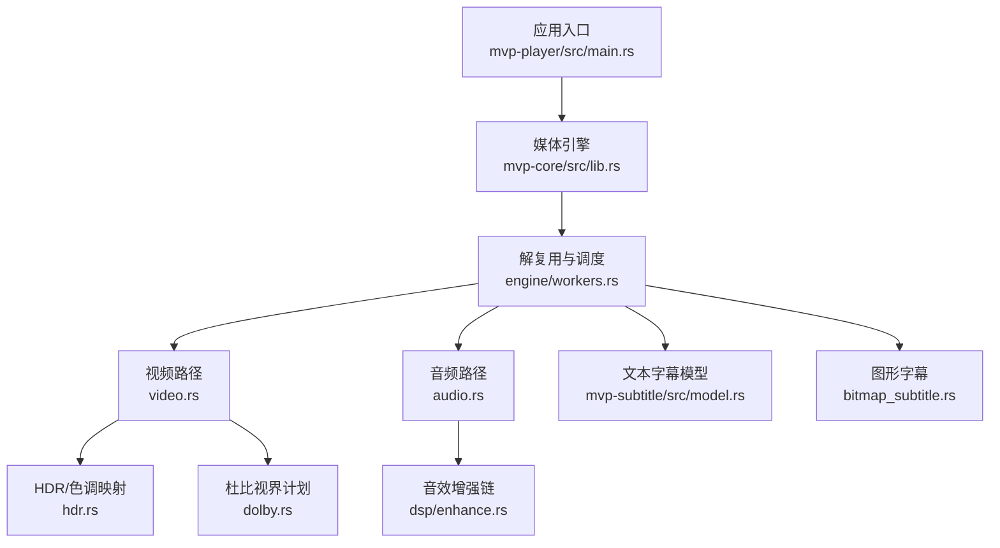
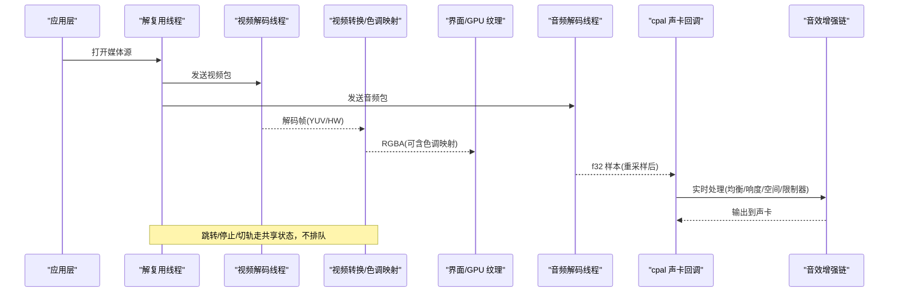
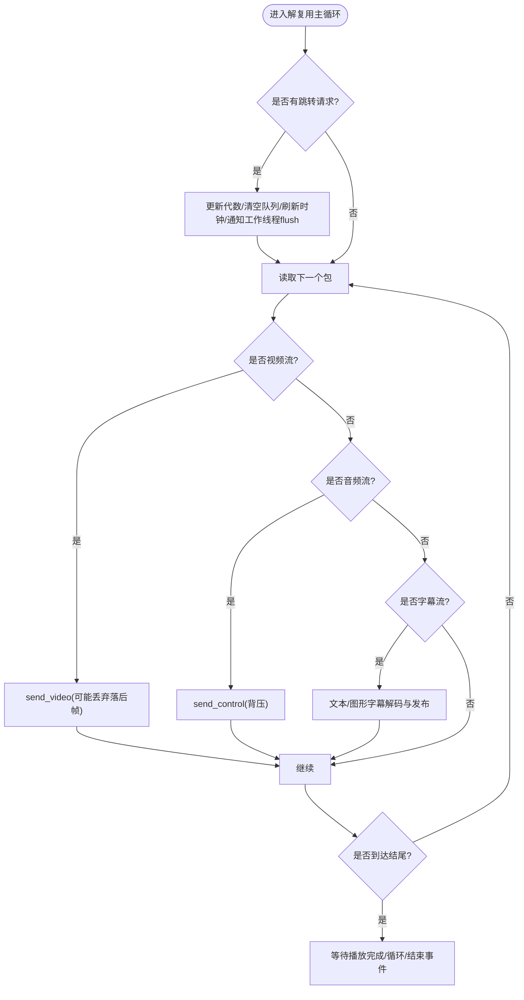
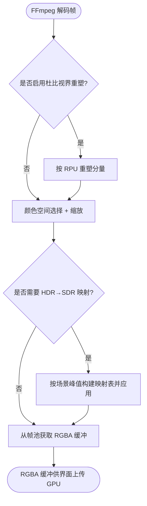
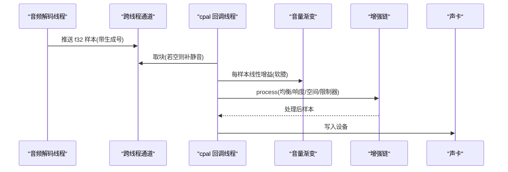
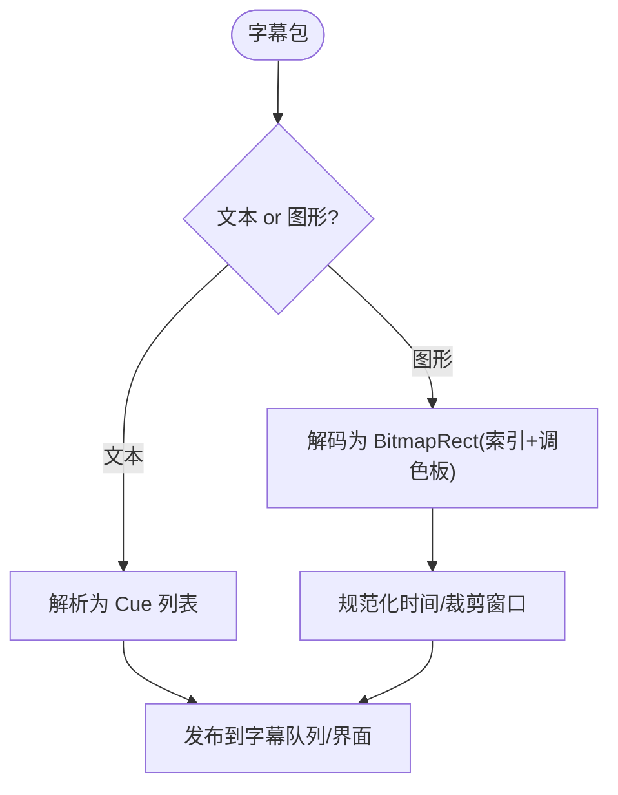
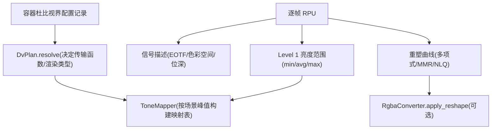
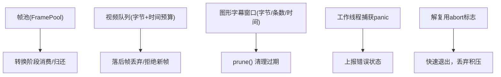
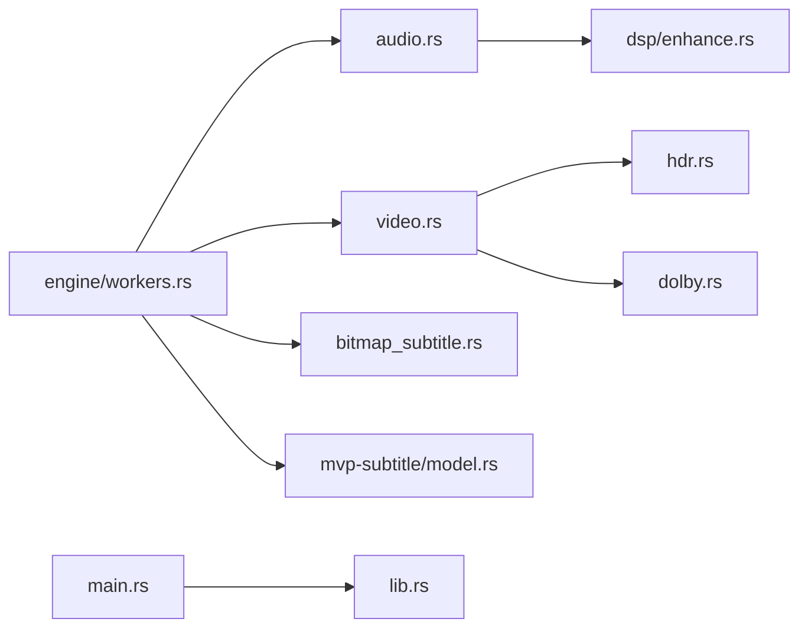

# 数据流设计

<cite>
**本文引用的文件**   
- [README.md](file://README.md)
- [lib.rs](file://crates/mvp-core/src/lib.rs)
- [workers.rs](file://crates/mvp-core/src/engine/workers.rs)
- [queue.rs](file://crates/mvp-core/src/engine/queue.rs)
- [clock.rs](file://crates/mvp-core/src/engine/clock.rs)
- [video.rs](file://crates/mvp-core/src/video.rs)
- [audio.rs](file://crates/mvp-core/src/audio.rs)
- [enhance.rs](file://crates/mvp-core/src/dsp/enhance.rs)
- [hdr.rs](file://crates/mvp-core/src/hdr.rs)
- [dolby.rs](file://crates/mvp-core/src/dolby.rs)
- [model.rs](file://crates/mvp-subtitle/src/model.rs)
- [bitmap_subtitle.rs](file://crates/mvp-core/src/bitmap_subtitle.rs)
- [main.rs](file://crates/mvp-player/src/main.rs)
</cite>

## 目录
1. [引言](#引言)
2. [项目结构](#项目结构)
3. [核心组件](#核心组件)
4. [架构总览](#架构总览)
5. [详细组件分析](#详细组件分析)
6. [依赖关系分析](#依赖关系分析)
7. [性能考量](#性能考量)
8. [故障排查指南](#故障排查指南)
9. [结论](#结论)
10. [附录](#附录)

## 引言
本文件面向“从文件输入到最终渲染”的完整数据流，覆盖解复用、音视频解码、字幕解析与渲染、HDR/杜比视界处理、音效增强链以及内存管理策略。目标是让非专业读者也能理解各阶段职责、关键优化点与常见问题的定位方法。

## 项目结构
播放器采用多 crate 分层：
- mvp-core：媒体引擎（FFmpeg 绑定、时钟、队列、视频/音频管线、HDR/杜比视界、DSP、图片查看器）。
- mvp-platform：Windows 集成（单实例、文件关联、电源等）。
- mvp-subtitle：纯逻辑字幕解析（SRT/ASS/WebVTT/MicroDVD）与编码识别。
- mvp-player：egui 界面与应用入口。

**图示来源**
- [main.rs:40-181](file://crates/mvp-player/src/main.rs#L40-L181)
- [lib.rs:1-46](file://crates/mvp-core/src/lib.rs#L1-L46)
- [workers.rs:134-417](file://crates/mvp-core/src/engine/workers.rs#L134-L417)
- [video.rs:1-17](file://crates/mvp-core/src/video.rs#L1-L17)
- [audio.rs:1-26](file://crates/mvp-core/src/audio.rs#L1-L26)
- [model.rs:1-55](file://crates/mvp-subtitle/src/model.rs#L1-L55)
- [bitmap_subtitle.rs:1-23](file://crates/mvp-core/src/bitmap_subtitle.rs#L1-L23)
- [hdr.rs:1-26](file://crates/mvp-core/src/hdr.rs#L1-L26)
- [dolby.rs:1-47](file://crates/mvp-core/src/dolby.rs#L1-L47)
- [enhance.rs:1-33](file://crates/mvp-core/src/dsp/enhance.rs#L1-L33)

**章节来源**
- [README.md:315-357](file://README.md#L315-L357)
- [main.rs:40-181](file://crates/mvp-player/src/main.rs#L40-L181)

## 核心组件
- 解复用与调度线程：负责打开容器、选择轨道、分发包到视频/音频/字幕通道，并处理跳转、A-B 循环、轨道切换与结束状态。
- 视频解码与转换：将 FFmpeg 解码出的帧转换为 RGBA，可选进行杜比视界重塑与 HDR→SDR 色调映射，再交给界面纹理上传。
- 音频输出与增强：通过 cpal 在设备回调线程中播放，内置十段均衡、低音/清晰度、响度归一化、空间感与限制器。
- 字幕系统：文本字幕统一为 Cue 模型；图形字幕以调色板索引图块表示，按需展开为 RGBA 绘制。
- HDR/杜比视界：解析容器配置记录与逐帧 RPU，决定基底层传输函数、动态元数据瞄准与重塑曲线。
- 时钟与队列：系统时钟为主时钟；视频/音频队列按字节预算与时间预算控制延迟与丢帧。
- 内存管理：帧池复用 RGBA 缓冲区；图形字幕窗口有字节与条数上限；所有工作线程捕获 panic。

**章节来源**
- [workers.rs:1-132](file://crates/mvp-core/src/engine/workers.rs#L1-L132)
- [queue.rs:67-253](file://crates/mvp-core/src/engine/queue.rs#L67-L253)
- [video.rs:18-142](file://crates/mvp-core/src/video.rs#L18-L142)
- [audio.rs:154-318](file://crates/mvp-core/src/audio.rs#L154-L318)
- [model.rs:73-136](file://crates/mvp-subtitle/src/model.rs#L73-L136)
- [bitmap_subtitle.rs:30-90](file://crates/mvp-core/src/bitmap_subtitle.rs#L30-L90)
- [hdr.rs:30-41](file://crates/mvp-core/src/hdr.rs#L30-L41)
- [dolby.rs:486-503](file://crates/mvp-core/src/dolby.rs#L486-L503)

## 架构总览
下图展示从文件到屏幕/声卡的端到端数据流，以及关键控制信号（跳转、停止、轨道切换）如何绕过队列直接生效。

**图示来源**
- [workers.rs:134-417](file://crates/mvp-core/src/engine/workers.rs#L134-L417)
- [video.rs:687-706](file://crates/mvp-core/src/video.rs#L687-L706)
- [audio.rs:320-461](file://crates/mvp-core/src/audio.rs#L320-L461)
- [enhance.rs:10-33](file://crates/mvp-core/src/dsp/enhance.rs#L10-L33)

## 详细组件分析

### 解复用与调度：数据包分发与控制流
- 解复用线程读取容器包，根据当前选择的轨道分发给视频/音频通道；字幕包在解复用侧即时解码为文本或图形字幕。
- 控制指令（跳转、停止、切轨）通过共享状态下发，不走包队列，避免被积压包阻塞。
- 视频包在队列落后于时钟时丢弃，音频保持背压以保证声音连续性。
- 字幕方面：文本字幕累积为 Cue 列表；图形字幕维护一个滑动窗口，按时间清理过期条目。

**图示来源**
- [workers.rs:469-687](file://crates/mvp-core/src/engine/workers.rs#L469-L687)
- [queue.rs:20-65](file://crates/mvp-core/src/engine/queue.rs#L20-L65)

**章节来源**
- [workers.rs:201-279](file://crates/mvp-core/src/engine/workers.rs#L201-L279)
- [workers.rs:469-687](file://crates/mvp-core/src/engine/workers.rs#L469-L687)
- [queue.rs:67-253](file://crates/mvp-core/src/engine/queue.rs#L67-L253)

### 视频路径：从 FFmpeg 解码到 GPU 纹理上传
- 解码线程接收包并调用 FFmpeg 解码，得到 YUV 或硬件帧；硬件帧在解码线程下载至系统内存。
- 转换阶段：
  - 可选杜比视界重塑（默认关闭），对分量进行分段多项式/MMR 变换。
  - 色彩空间选择与缩放：swscale 缓存上下文，仅在尺寸/格式变化时重建。
  - HDR→SDR 色调映射：基于 BT.2020→BT.709 矩阵与亮度曲线，按场景峰值平滑调整。
  - 输出紧凑 RGBA8，来自帧池，零拷贝传给界面纹理。
- 帧池：按最佳匹配分配、限制总保留字节数，避免频繁分配与清零。

**图示来源**
- [video.rs:687-706](file://crates/mvp-core/src/video.rs#L687-L706)
- [video.rs:720-749](file://crates/mvp-core/src/video.rs#L720-L749)
- [video.rs:753-800](file://crates/mvp-core/src/video.rs#L753-L800)
- [hdr.rs:352-495](file://crates/mvp-core/src/hdr.rs#L352-L495)
- [video.rs:57-142](file://crates/mvp-core/src/video.rs#L57-L142)

**章节来源**
- [video.rs:1-17](file://crates/mvp-core/src/video.rs#L1-L17)
- [video.rs:57-142](file://crates/mvp-core/src/video.rs#L57-L142)
- [video.rs:687-749](file://crates/mvp-core/src/video.rs#L687-L749)
- [hdr.rs:352-495](file://crates/mvp-core/src/hdr.rs#L352-L495)

### 音频路径：解码、重采样、增强与 cpal 输出
- 音频设备只打开一次，使用设备原生采样率与声道数；所有解码输出先重采样到该布局。
- 输出回调线程无锁、无分配：参数通过原子序列锁发布；音量在回调中渐变，避免爆音。
- 增强链顺序：十段均衡 → 低音/谐波 → 清晰度/瞬态 → 响度归一化 → 空间感（宽度+混响）→ 软限制器。
- 当增强关闭且所有控件中性时，整条链旁路，逐样本与未启用一致。

**图示来源**
- [audio.rs:320-461](file://crates/mvp-core/src/audio.rs#L320-L461)
- [enhance.rs:10-33](file://crates/mvp-core/src/dsp/enhance.rs#L10-L33)

**章节来源**
- [audio.rs:154-318](file://crates/mvp-core/src/audio.rs#L154-L318)
- [audio.rs:320-461](file://crates/mvp-core/src/audio.rs#L320-L461)
- [enhance.rs:58-105](file://crates/mvp-core/src/dsp/enhance.rs#L58-L105)
- [enhance.rs:206-321](file://crates/mvp-core/src/dsp/enhance.rs#L206-L321)

### 字幕路径：文本与图形字幕的不同处理
- 文本字幕：统一解析为 Cue（时间区间 + 纯文本 + 样式），支持 SRT/ASS/WebVTT/MicroDVD，自动编码识别。
- 图形字幕：PGS/VobSub/DVB 由 FFmpeg 解码为调色板索引图块，存储为 paletted 形式，显示时按需展开为 RGBA。
- 图形字幕窗口按时间与字节上限裁剪，避免长片占用过多内存。

**图示来源**
- [model.rs:73-136](file://crates/mvp-subtitle/src/model.rs#L73-L136)
- [bitmap_subtitle.rs:230-355](file://crates/mvp-core/src/bitmap_subtitle.rs#L230-L355)
- [bitmap_subtitle.rs:137-172](file://crates/mvp-core/src/bitmap_subtitle.rs#L137-L172)

**章节来源**
- [model.rs:1-55](file://crates/mvp-subtitle/src/model.rs#L1-L55)
- [model.rs:73-136](file://crates/mvp-subtitle/src/model.rs#L73-L136)
- [bitmap_subtitle.rs:30-90](file://crates/mvp-core/src/bitmap_subtitle.rs#L30-L90)
- [bitmap_subtitle.rs:137-172](file://crates/mvp-core/src/bitmap_subtitle.rs#L137-L172)

### HDR 与杜比视界：元数据提取与色调映射
- 容器配置记录：Profile/Level/层/兼容层，决定基底层传输函数（PQ/HLG/SDR）。
- 逐帧 RPU：提供信号色彩空间、EOTF、母版窗口、活动画面区域与重塑曲线；Level 1 给出每帧亮度范围用于瞄准色调曲线。
- 重塑曲线：分段多项式/MMR 与非线性反量化（NLQ），默认关闭以避免未经验证的色彩数学影响。
- 色调映射：CPU 近似实现，按亮度曲线 + BT.2020→BT.709 矩阵逐像素换算；GPU 着色器实现是下一步目标。

**图示来源**
- [hdr.rs:60-162](file://crates/mvp-core/src/hdr.rs#L60-L162)
- [dolby.rs:486-503](file://crates/mvp-core/src/dolby.rs#L486-L503)
- [dolby.rs:756-798](file://crates/mvp-core/src/dolby.rs#L756-L798)
- [video.rs:720-749](file://crates/mvp-core/src/video.rs#L720-L749)
- [hdr.rs:352-495](file://crates/mvp-core/src/hdr.rs#L352-L495)

**章节来源**
- [hdr.rs:1-26](file://crates/mvp-core/src/hdr.rs#L1-L26)
- [hdr.rs:60-162](file://crates/mvp-core/src/hdr.rs#L60-L162)
- [hdr.rs:352-495](file://crates/mvp-core/src/hdr.rs#L352-L495)
- [dolby.rs:1-47](file://crates/mvp-core/src/dolby.rs#L1-L47)
- [dolby.rs:486-503](file://crates/mvp-core/src/dolby.rs#L486-L503)
- [dolby.rs:756-798](file://crates/mvp-core/src/dolby.rs#L756-L798)

### 内存管理策略：帧池、纹理缓存与泄漏防护
- 帧池 FramePool：按最佳匹配分配 RGBA 缓冲，限制总保留字节数，避免 4K 帧导致 GB 级内存。
- 视频队列 VideoQueue：同时按帧数与字节预算限制，结合时间预算控制解码超前量，防止高码率/高分辨率下内存爆炸。
- 图形字幕窗口：按时间 floor 裁剪，限制最大字节与条数，避免长片积累。
- 线程安全与异常防护：每个工作线程捕获 panic，损坏文件仅上报错误，不拖垮整个播放器。
- 关闭快速退出：解复用 abort 标志在工作线程循环开头检查，丢弃积压包；音频 push 超时在关闭时立即返回。

**图示来源**
- [video.rs:57-142](file://crates/mvp-core/src/video.rs#L57-L142)
- [queue.rs:67-253](file://crates/mvp-core/src/engine/queue.rs#L67-L253)
- [bitmap_subtitle.rs:137-172](file://crates/mvp-core/src/bitmap_subtitle.rs#L137-L172)
- [workers.rs:1-12](file://crates/mvp-core/src/engine/workers.rs#L1-L12)
- [workers.rs:196-279](file://crates/mvp-core/src/engine/workers.rs#L196-L279)

**章节来源**
- [video.rs:57-142](file://crates/mvp-core/src/video.rs#L57-L142)
- [queue.rs:67-253](file://crates/mvp-core/src/engine/queue.rs#L67-L253)
- [bitmap_subtitle.rs:137-172](file://crates/mvp-core/src/bitmap_subtitle.rs#L137-L172)
- [workers.rs:1-12](file://crates/mvp-core/src/engine/workers.rs#L1-L12)

## 依赖关系分析
- 模块耦合：
  - engine/workers.rs 依赖 audio.rs、video.rs、bitmap_subtitle.rs、mvp-subtitle 模型。
  - video.rs 依赖 hdr.rs、dolby.rs。
  - audio.rs 依赖 dsp/enhance.rs。
  - main.rs 初始化日志与窗口，驱动 PlayerApp，间接触发引擎生命周期。
- 外部依赖：FFmpeg（解码/解复用）、cpal（音频输出）、egui/eframe（界面）。

**图示来源**
- [workers.rs:1-24](file://crates/mvp-core/src/engine/workers.rs#L1-L24)
- [video.rs:1-17](file://crates/mvp-core/src/video.rs#L1-L17)
- [audio.rs:1-35](file://crates/mvp-core/src/audio.rs#L1-L35)
- [main.rs:40-181](file://crates/mvp-player/src/main.rs#L40-L181)
- [lib.rs:1-46](file://crates/mvp-core/src/lib.rs#L1-L46)

**章节来源**
- [workers.rs:1-24](file://crates/mvp-core/src/engine/workers.rs#L1-L24)
- [video.rs:1-17](file://crates/mvp-core/src/video.rs#L1-L17)
- [audio.rs:1-35](file://crates/mvp-core/src/audio.rs#L1-L35)
- [main.rs:40-181](file://crates/mvp-player/src/main.rs#L40-L181)
- [lib.rs:1-46](file://crates/mvp-core/src/lib.rs#L1-L46)

## 性能考量
- 解复用与调度：
  - 视频包在落后时钟时丢弃，避免越积越慢；音频保持背压保证声音连续。
  - 控制指令不走队列，避免自死锁与卡顿。
- 视频路径：
  - swscale 上下文缓存，仅在几何/格式变化时重建。
  - 色调映射按场景峰值平滑，避免闪烁；帧池复用 RGBA 缓冲，减少分配。
  - 杜比视界重塑默认关闭，避免不必要的计算与潜在色彩偏差。
- 音频路径：
  - 设备回调线程无分配、无锁；参数通过原子序列锁发布，平滑过渡。
  - 增强链在关闭且中性值时完全旁路，逐样本一致性保障。
- 时钟：
  - 系统时钟为主时钟，避免设备计数器漂移导致的画面狂奔或冻结。
- 内存：
  - 视频队列按字节与时间双重预算；图形字幕窗口限制字节与条数；帧池限制总保留大小。

[本节为通用性能讨论，不直接分析具体文件]

## 故障排查指南
- 解码无输出：解复用持续投喂但解码器长时间无输出会报“解码无输出”，可能是容器误判或损坏文件。
- 跳转卡顿：检查是否发生自死锁（MPEG-TS 二分查找回调自身）；代码已修复，若仍出现需确认跳转路径。
- 音频欠载：统计面板可查看 underruns；检查设备回调是否被阻塞或增强链参数突变。
- 画面冻结：检查视频队列是否落后时钟；必要时允许丢弃落后帧恢复节奏。
- 杜比视界颜色异常：确认 Profile/兼容层与传输函数选择是否正确；开启重塑前对照 libplacebo。
- 关闭缓慢：确保关闭时设置 closing 标志，使 push 超时立即返回；解复用 abort 标志应被工作线程检查。

**章节来源**
- [README.md:35-41](file://README.md#L35-L41)
- [README.md:439-453](file://README.md#L439-L453)
- [workers.rs:93-112](file://crates/mvp-core/src/engine/workers.rs#L93-L112)
- [audio.rs:519-575](file://crates/mvp-core/src/audio.rs#L519-L575)

## 结论
该播放器通过解复用线程统一调度、独立音视频解码线程、严格的队列与预算控制、以及 CPU 近似的 HDR 色调映射与可选杜比视界重塑，实现了稳定、低延迟且可扩展的数据流。未来可将色调映射迁移至 GPU 着色器，并将杜比视界增强层接入与校验完善，进一步提升画质与准确性。

[本节为总结性内容，不直接分析具体文件]

## 附录
- 启动与运行：命令行参数解析、单实例 IPC、窗口创建与 eframe 初始化。
- 测试与素材：端到端播放测试、杜比视界探测示例、图形字幕测试条件。

**章节来源**
- [main.rs:40-181](file://crates/mvp-player/src/main.rs#L40-L181)
- [README.md:457-545](file://README.md#L457-L545)