# 架构总览

<cite>
**本文引用的文件**   
- [README.md](file://README.md)
- [Cargo.toml](file://Cargo.toml)
- [main.rs](file://crates/mvp-player/src/main.rs)
- [app.rs](file://crates/mvp-player/src/app.rs)
- [lib.rs（mvp-core）](file://crates/mvp-core/src/lib.rs)
- [workers.rs](file://crates/mvp-core/src/engine/workers.rs)
- [clock.rs](file://crates/mvp-core/src/engine/clock.rs)
- [queue.rs](file://crates/mvp-core/src/engine/queue.rs)
- [hdr.rs](file://crates/mvp-core/src/hdr.rs)
- [dolby.rs](file://crates/mvp-core/src/dolby.rs)
- [lib.rs（mvp-subtitle）](file://crates/mvp-subtitle/src/lib.rs)
- [lib.rs（mvp-platform）](file://crates/mvp-platform/src/lib.rs)
</cite>

## 目录
1. [引言](#引言)
2. [项目结构](#项目结构)
3. [核心组件](#核心组件)
4. [架构总览](#架构总览)
5. [详细组件分析](#详细组件分析)
6. [依赖关系分析](#依赖关系分析)
7. [性能与背压特性](#性能与背压特性)
8. [故障排查指南](#故障排查指南)
9. [结论](#结论)

## 引言
MVP-Versatile-Player 是一个面向 Windows 的多功能音视频与图片播放器，直接链接 FFmpeg 内核，采用四个 Rust crate 协作：媒体引擎、Windows 系统集成、字幕解析和 egui 界面。其播放管线由解复用线程、视频解码线程和音频解码线程组成，通过共享状态、带字节预算的队列以及系统时钟驱动的主时钟完成音视频同步；UI 层与引擎层分离，事件驱动地管理播放状态、轨道、字幕、HDR 处理与 Windows 集成能力。

## 项目结构
仓库采用 Cargo workspace 组织四个 crate：
- mvp-core：FFmpeg 绑定、播放引擎、时钟、队列、HDR/Dolby Vision、图片查看器、播放列表。
- mvp-platform：Windows 外壳、单实例 IPC、电源、显示器与工作区。
- mvp-subtitle：SRT / ASS / VTT / MicroDVD 等字幕解析与编码识别。
- mvp-player：egui 界面、应用程序对象、GL 渲染、设置与主题。

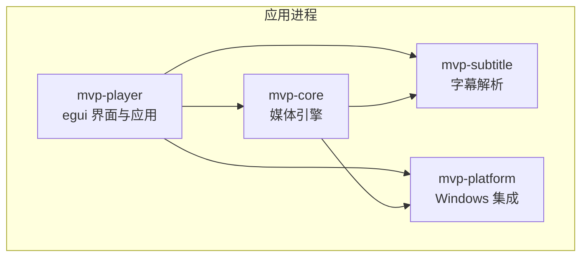

**图表来源**
- [README.md:315-323](file://README.md#L315-L323)
- [Cargo.toml:1-8](file://Cargo.toml#L1-L8)

**章节来源**
- [README.md:315-323](file://README.md#L315-L323)
- [Cargo.toml:1-8](file://Cargo.toml#L1-L8)

## 核心组件
- 媒体引擎：负责打开媒体源、选择流、启动解复用与解码工作线程、维护播放时钟、队列、音量和变速、字幕轨道、HDR 与杜比视界策略。
- 播放管线：解复用线程从容器读取包，分发到视频与音频解码线程；文本字幕在解复用阶段解析为时间区间，图形字幕解码为位图并进入显示窗口。
- 主时钟：以系统时钟为主，音频设备作为样本级参考；暂停时冻结，跳转时重置锚点，变速时缩放推进速度。
- 队列与背压：视频与音频通道有固定容量，帧队列按字节和时间双重预算限制；视频落后时丢帧保流畅，音频保持背压避免断音。
- HDR 与杜比视界：从容器配置记录与逐帧 RPU 判断基底层传输函数、色彩空间与重塑需求；SDR 显示器上执行近似色调映射，默认关闭增强层重塑。
- 字幕：外部或内嵌文本字幕经 mvp-subtitle 解析为统一模型；图形字幕解码为位图并在画面中绘制。
- Windows 集成：单实例、文件关联、任务栏、深色标题栏、阻止休眠、显示器尺寸与工作区。

**章节来源**
- [lib.rs（mvp-core）:1-47](file://crates/mvp-core/src/lib.rs#L1-L47)
- [README.md:325-357](file://README.md#L325-L357)
- [README.md:359-414](file://README.md#L359-L414)
- [README.md:425-453](file://README.md#L425-L453)

## 架构总览
整体数据流从媒体源进入解复用线程，再分别流向视频解码与音频解码线程；视频帧进入 UI 纹理上传路径，音频样本进入 cpal 声卡回调；字幕在解复用阶段解析后进入 UI 显示层。控制指令（跳转、切换轨道、停止）通过共享状态下发，不走数据包队列，避免控制消息被积压延迟。

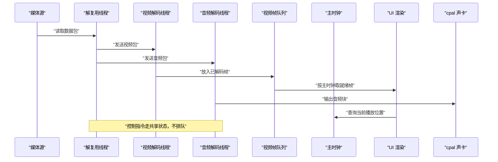

**图表来源**
- [workers.rs:134-146](file://crates/mvp-core/src/engine/workers.rs#L134-L146)
- [workers.rs:201-279](file://crates/mvp-core/src/engine/workers.rs#L201-L279)
- [queue.rs:1-66](file://crates/mvp-core/src/engine/queue.rs#L1-L66)
- [clock.rs:1-46](file://crates/mvp-core/src/engine/clock.rs#L1-L46)

## 详细组件分析

### 播放管线与三个关键线程
- 解复用线程：初始化 FFmpeg 输入上下文，探测媒体信息，选择视频、音频与字幕流；根据 A/B 循环、轨道变更、跳转请求调度工作线程；对视频包使用带超时发送与“落后即丢弃”策略，对音频包使用受控发送；遇到 EOF 时通知两端解码器并维持等待重启。
- 视频解码线程：接收包，解码为帧，送入颜色转换与帧队列；队列按字节预算与时间预算限制，消费端按主时钟取最近可展示帧，超时的旧帧被丢弃。
- 音频解码线程：接收包，解码并重采样，输出到 cpal 设备；暂停时回调不再运行，停止时先标记声卡关闭以避免阻塞。

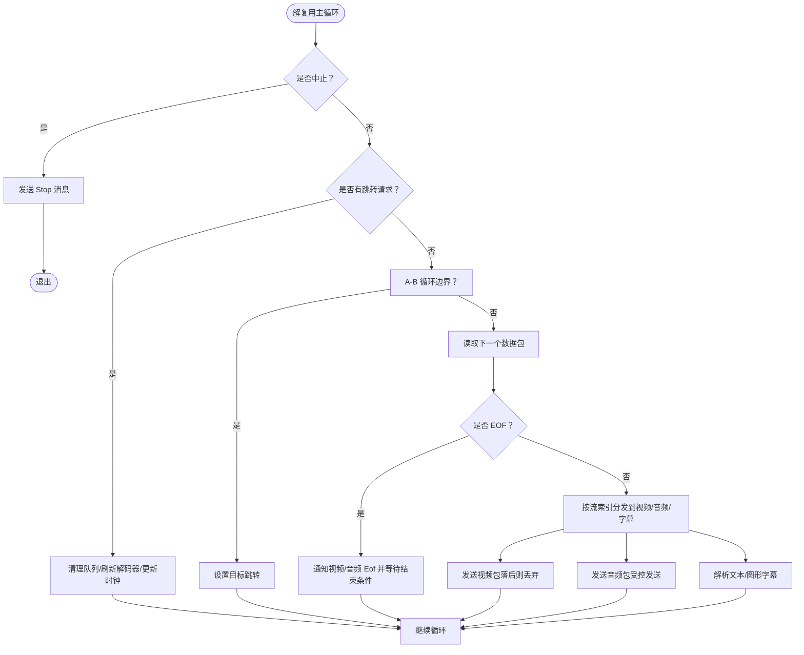

**图表来源**
- [workers.rs:281-687](file://crates/mvp-core/src/engine/workers.rs#L281-L687)
- [workers.rs:689-793](file://crates/mvp-core/src/engine/workers.rs#L689-L793)

**章节来源**
- [workers.rs:134-146](file://crates/mvp-core/src/engine/workers.rs#L134-L146)
- [workers.rs:201-279](file://crates/mvp-core/src/engine/workers.rs#L201-L279)
- [workers.rs:281-687](file://crates/mvp-core/src/engine/workers.rs#L281-L687)
- [workers.rs:689-793](file://crates/mvp-core/src/engine/workers.rs#L689-L793)

### 主时钟同步机制
主时钟以系统时钟为基准，音频设备提供样本级参考；当音频可用且处于准备状态时，时钟认为音频驱动有效，否则回退到墙上时钟。暂停时冻结位置，跳转时重置锚点并刷新音频缓冲，变速时按比例推进。

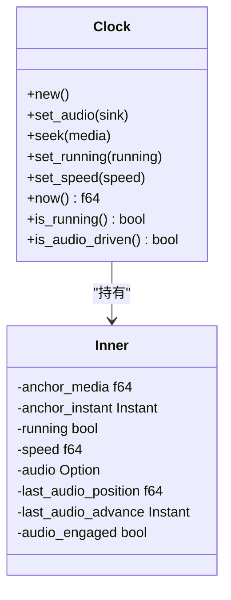

**图表来源**
- [clock.rs:43-159](file://crates/mvp-core/src/engine/clock.rs#L43-L159)

**章节来源**
- [clock.rs:1-46](file://crates/mvp-core/src/engine/clock.rs#L1-L46)
- [clock.rs:133-159](file://crates/mvp-core/src/engine/clock.rs#L133-L159)

### 队列管理与背压策略
- 视频通道：解复用器向视频解码线程发送包时使用超时发送；若队列前端 PTS 落后于主时钟超过阈值，则丢弃包以避免进一步滞后。
- 音频通道：解复用器向音频解码线程发送包时使用受控发送，避免阻塞；音频解码器写队列时最多阻塞一段时间做背压，暂停时输出回调不再运行，停止时先关闭声卡以缩短等待。
- 帧队列：按字节预算与时间预算限制，最小保留两帧；`take_ready` 返回最接近当前时间的帧，并统计被替代的帧数用于统计面板。

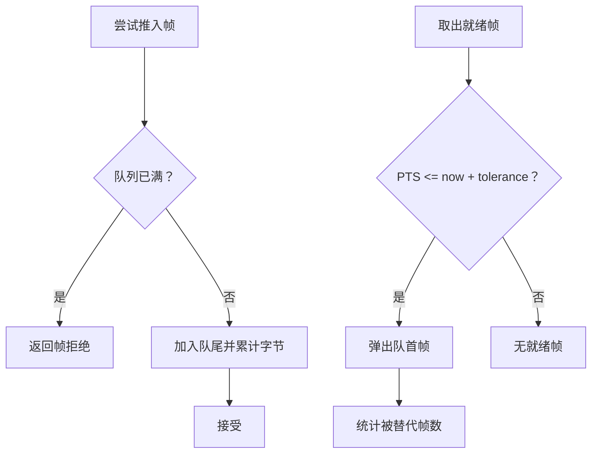

**图表来源**
- [queue.rs:67-253](file://crates/mvp-core/src/engine/queue.rs#L67-L253)
- [workers.rs:201-279](file://crates/mvp-core/src/engine/workers.rs#L201-L279)

**章节来源**
- [queue.rs:67-253](file://crates/mvp-core/src/engine/queue.rs#L67-L253)
- [workers.rs:201-279](file://crates/mvp-core/src/engine/workers.rs#L201-L279)

### UI 层与引擎层的分离设计
UI 层通过 `PlayerApp` 持有引擎、播放列表、设置与界面状态；引擎负责打开媒体、解码与同步，UI 只负责渲染与用户交互。打开文件时 UI 调用引擎 `open`，引擎发布 `Opened` 事件，UI 据此决定模式（视频/音频/图片）、加载侧边字幕、恢复断点位置。

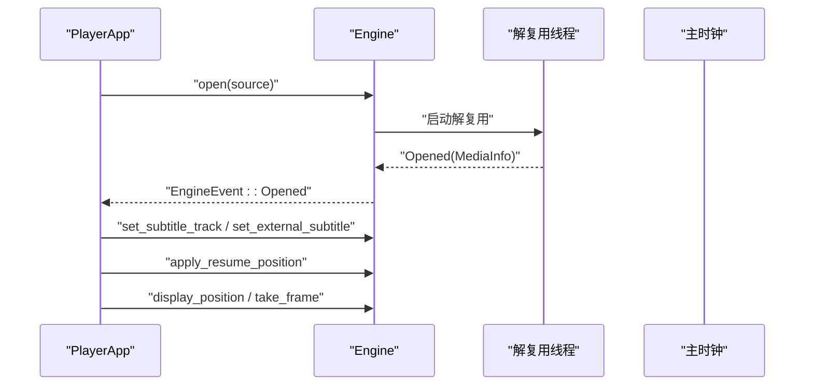

**图表来源**
- [app.rs:484-544](file://crates/mvp-player/src/app.rs#L484-L544)
- [app.rs:583-597](file://crates/mvp-player/src/app.rs#L583-L597)
- [app.rs:715-769](file://crates/mvp-player/src/app.rs#L715-L769)

**章节来源**
- [app.rs:65-204](file://crates/mvp-player/src/app.rs#L65-L204)
- [app.rs:484-544](file://crates/mvp-player/src/app.rs#L484-L544)
- [app.rs:715-769](file://crates/mvp-player/src/app.rs#L715-L769)

### 事件驱动的状态管理模式
- 引擎状态：Playing / Paused / Ended / Error，由解复用线程与 EOF 处理逻辑更新。
- UI 状态：Mode（Video/Audio/Image）、Overlay、Toast、Sidebar、PictureSettings 等，由 `PlayerApp::update` 响应引擎事件与用户操作。
- 控制指令：跳转、切换轨道、A-B 循环通过共享状态下发，避免与控制消息竞争。

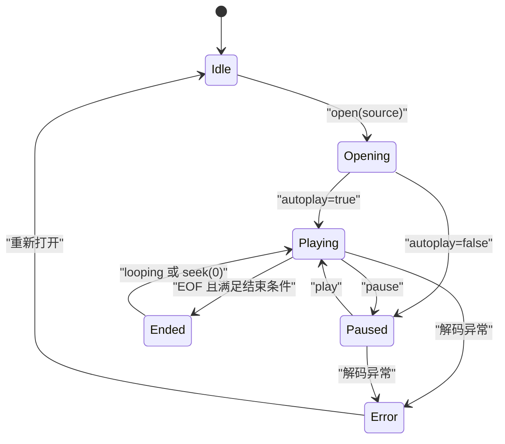

**图表来源**
- [workers.rs:451-457](file://crates/mvp-core/src/engine/workers.rs#L451-L457)
- [workers.rs:689-793](file://crates/mvp-core/src/engine/workers.rs#L689-L793)

**章节来源**
- [workers.rs:451-457](file://crates/mvp-core/src/engine/workers.rs#L451-L457)
- [workers.rs:689-793](file://crates/mvp-core/src/engine/workers.rs#L689-L793)

### HDR 处理管线
HDR 管线从容器参数与帧元数据推断 HDR 类型（PQ/HLG/SDR），解析杜比视界配置记录，决定基底层传输函数与是否需要色调映射；ToneMapper 将 BT.2020 PQ/HLG 映射到 SDR 显示范围，包含亮度曲线与色域矩阵转换。杜比视界的 RPU 提供每帧亮度范围，用于动态调整映射肩部。

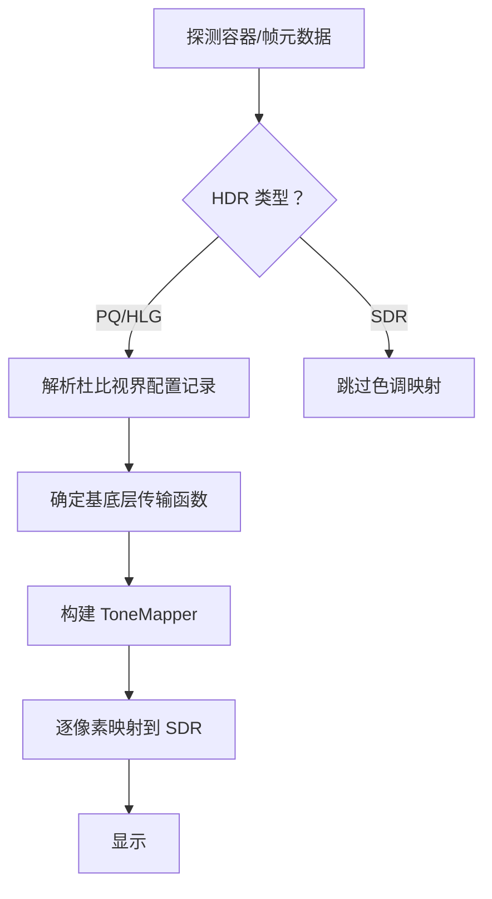

**图表来源**
- [hdr.rs:1-26](file://crates/mvp-core/src/hdr.rs#L1-L26)
- [hdr.rs:164-271](file://crates/mvp-core/src/hdr.rs#L164-L271)
- [hdr.rs:344-479](file://crates/mvp-core/src/hdr.rs#L344-L479)

**章节来源**
- [hdr.rs:1-26](file://crates/mvp-core/src/hdr.rs#L1-L26)
- [hdr.rs:164-271](file://crates/mvp-core/src/hdr.rs#L164-L271)
- [hdr.rs:344-479](file://crates/mvp-core/src/hdr.rs#L344-L479)

### 杜比视界与重塑
杜比视界模块解析容器配置记录与逐帧 RPU，决定渲染计划：单层基底层、IPT 基底层或未知；默认关闭非线性重塑，因为色度曲线尚未完全对齐 libplacebo。RPU Level 1 提供每帧亮度范围，用于色调映射瞄准场景峰值；Level 2/5/6 提供显示器微调与活动区域等信息。

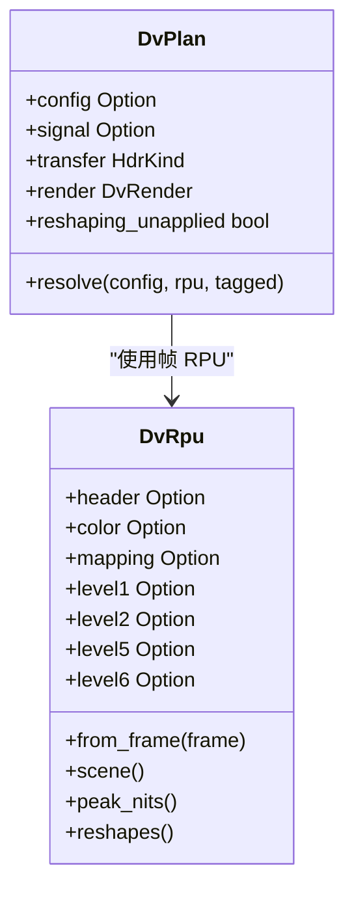

**图表来源**
- [dolby.rs:735-798](file://crates/mvp-core/src/dolby.rs#L735-L798)
- [dolby.rs:478-708](file://crates/mvp-core/src/dolby.rs#L478-L708)

**章节来源**
- [dolby.rs:1-87](file://crates/mvp-core/src/dolby.rs#L1-L87)
- [dolby.rs:735-798](file://crates/mvp-core/src/dolby.rs#L735-L798)
- [dolby.rs:478-708](file://crates/mvp-core/src/dolby.rs#L478-L708)

### 字幕解析流程
字幕解析库支持 SRT、ASS/SSA、WebVTT、MicroDVD，统一建模为 Cue 序列；播放器在 UI 层加载外部字幕文件，引擎侧可选择内嵌或外部字幕轨道；图形字幕（PGS/VobSub/DVB）解码为位图并在画面中绘制。

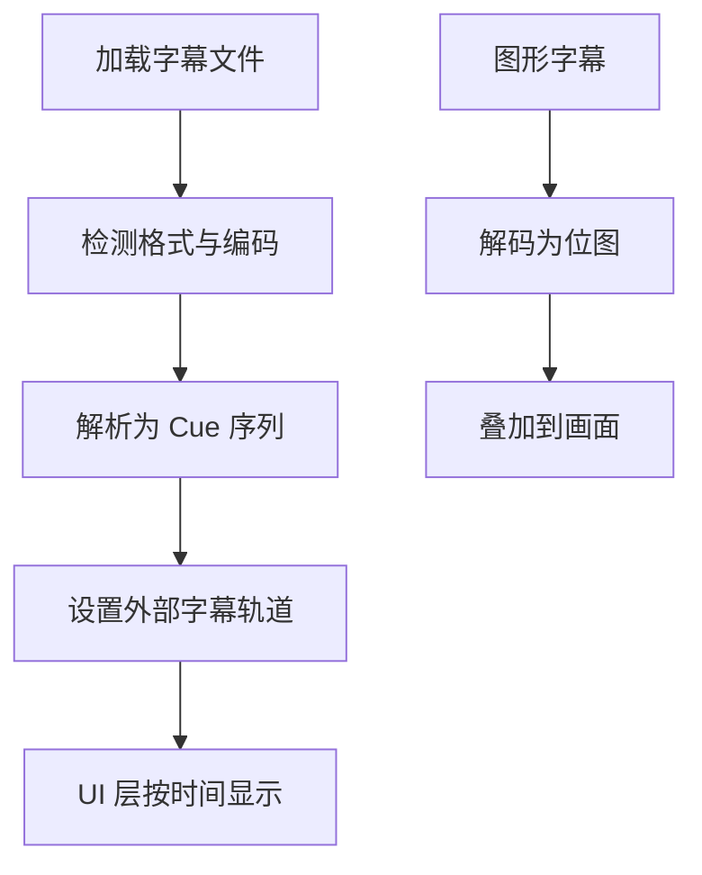

**图表来源**
- [lib.rs（mvp-subtitle）:1-60](file://crates/mvp-subtitle/src/lib.rs#L1-L60)
- [app.rs:609-668](file://crates/mvp-player/src/app.rs#L609-L668)

**章节来源**
- [lib.rs（mvp-subtitle）:1-60](file://crates/mvp-subtitle/src/lib.rs#L1-L60)
- [app.rs:609-668](file://crates/mvp-player/src/app.rs#L609-L668)

### Windows 系统集成点
- 单实例：命名互斥体 + 隐藏顶层窗口作为 WM_COPYDATA IPC 端点；二次实例将文件列表发送给主实例。
- 文件关联：HKCU 下注册扩展名、ProgID、Capabilities 与右键菜单，无需管理员权限。
- 外壳与电源：AppUserModelID、深色标题栏、任务栏闪烁、播放时阻止休眠。
- 显示器与工作区：获取主显示器工作区与缩放，确保窗口尺寸与位置合理。

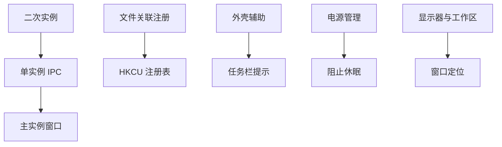

**图表来源**
- [lib.rs（mvp-platform）:1-34](file://crates/mvp-platform/src/lib.rs#L1-L34)
- [main.rs:65-99](file://crates/mvp-player/src/main.rs#L65-L99)

**章节来源**
- [lib.rs（mvp-platform）:1-34](file://crates/mvp-platform/src/lib.rs#L1-L34)
- [main.rs:65-99](file://crates/mvp-player/src/main.rs#L65-L99)

## 依赖关系分析
- mvp-player 依赖 mvp-core、mvp-subtitle、mvp-platform。
- mvp-core 依赖 ffmpeg-next、cpal、crossbeam-channel、parking_lot、image 等。
- mvp-platform 依赖 windows crate 与平台 API。
- mvp-subtitle 纯逻辑，无平台依赖。

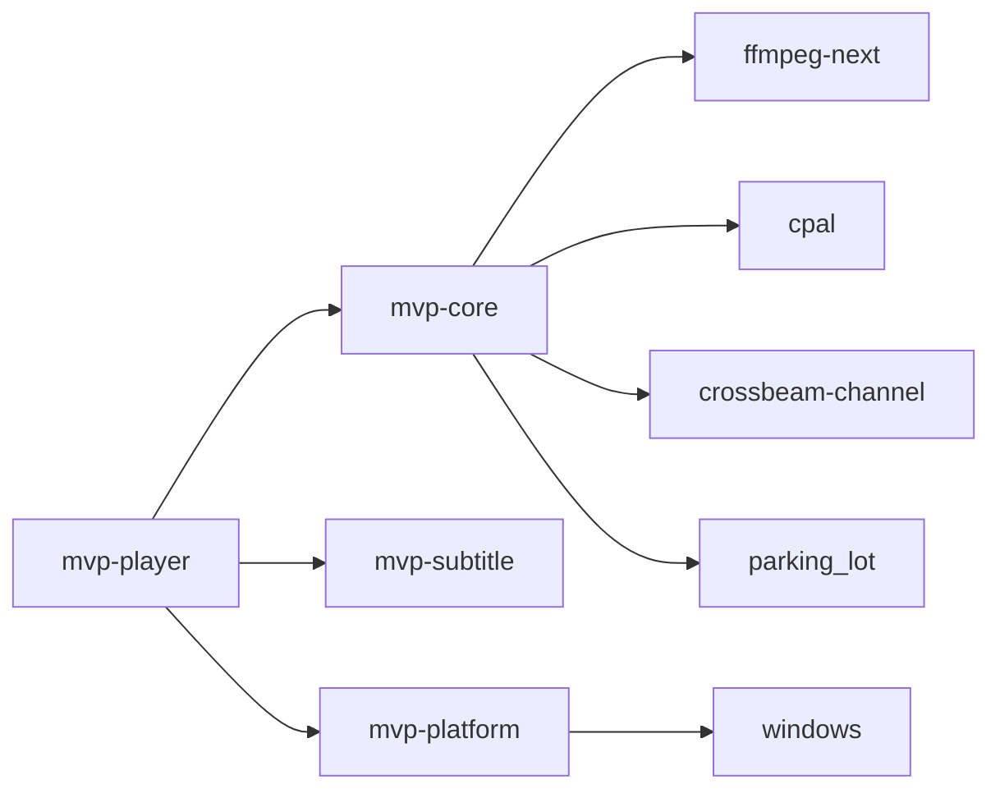

**图表来源**
- [Cargo.toml:17-52](file://Cargo.toml#L17-L52)
- [Cargo.toml:33-42](file://Cargo.toml#L33-L42)

**章节来源**
- [Cargo.toml:1-8](file://Cargo.toml#L1-L8)
- [Cargo.toml:17-52](file://Cargo.toml#L17-L52)

## 性能与背压特性
- 启动速度：窗口出现前仅解析命令行、申请单实例互斥体、预取字体；FFmpeg 表懒初始化，声卡在首次播放时打开。
- 关闭速度：不清理积压，解复用 abort 标志快速退出；音频解码器写队列最多阻塞 500 ms，暂停时回调不运行，停止时先关闭声卡。
- 队列预算：视频与音频通道固定容量，帧队列按字节与时间预算限制；4K RGBA 一帧约 33 MB，避免缓存占用过大。
- 主时钟漂移：系统时钟单调精确，音频设备计数器可能不准，因此采用系统时钟为主，代价是长期累计漂移几百毫秒。
- HDR 映射成本：CPU 色调映射近似实现，1080p 约 22 ms/帧，4K 约 90 ms/帧；未来应迁移至 GPU 着色器。

**章节来源**
- [README.md:425-453](file://README.md#L425-L453)
- [README.md:325-357](file://README.md#L325-L357)
- [README.md:553-558](file://README.md#L553-L558)

## 故障排查指南
- 解码无输出：解复用器持续投喂而解码器长时间无输出，12 秒内报错并停下，避免空转。
- 损坏文件：每个工作线程捕获 panic，转为错误状态，不影响整个播放器。
- 自死锁跳转：无索引容器（如 MPEG-TS）跳转靠二分查找读包，回调会进入播放器自身；代码中通过作用域锁与中断回调避免自死锁。
- 日志：发布版本无控制台，日志写入 `%APPDATA%\MVP-Versatile-Player\mvp.log`，超过 2 MB 自动轮转。

**章节来源**
- [README.md:35-41](file://README.md#L35-L41)
- [README.md:435-453](file://README.md#L435-L453)
- [workers.rs:1-6](file://crates/mvp-core/src/engine/workers.rs#L1-L6)

## 结论
MVP-Versatile-Player 通过四个 crate 清晰分离职责：引擎负责解码与同步，UI 负责渲染与交互，字幕解析独立可测试，Windows 集成隔离平台差异。播放管线采用三线程架构与共享状态控制，主时钟基于系统时钟并提供音频参考，队列按字节与时间预算限制，视频丢帧保流畅、音频背压保连续。HDR 与杜比视界管线在 CPU 上做近似映射，RPU 提供逐帧亮度范围；字幕解析统一模型，图形字幕位图绘制。该架构兼顾性能、稳定性与可维护性，适合开发者理解各组件如何协同工作。