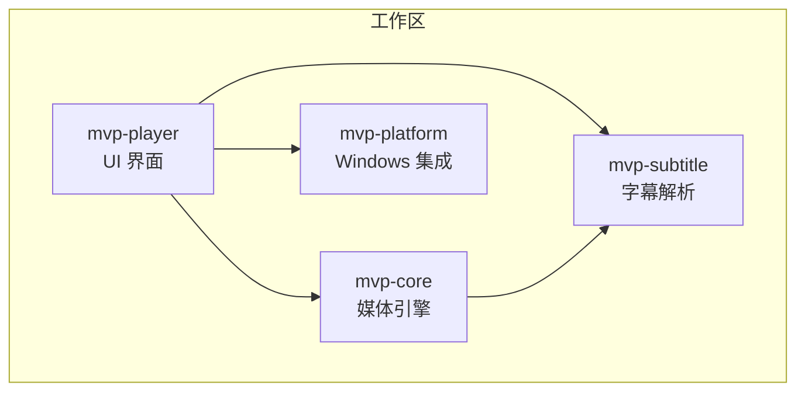
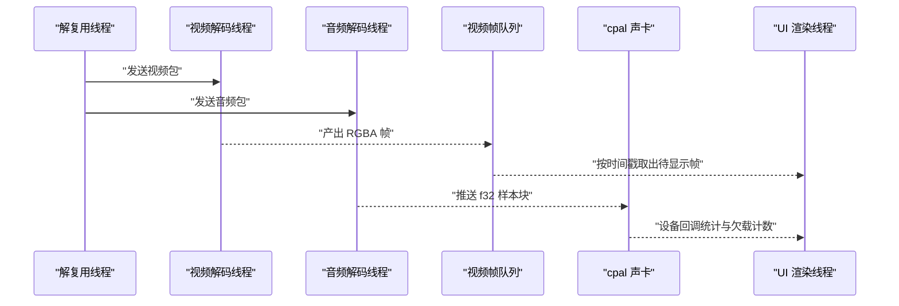
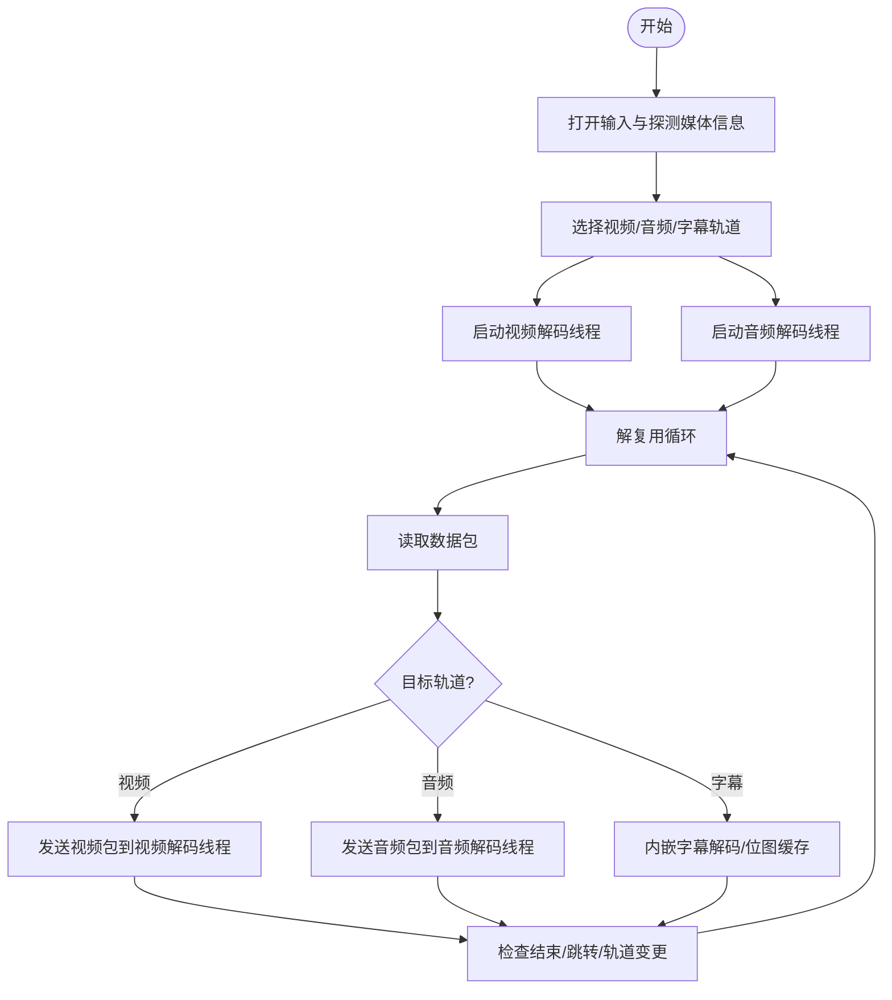
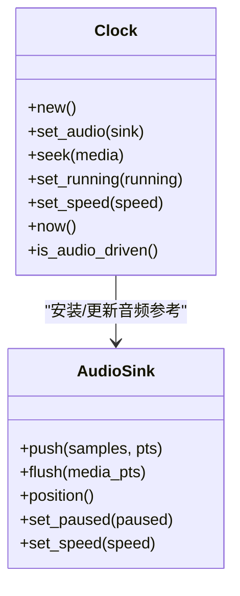
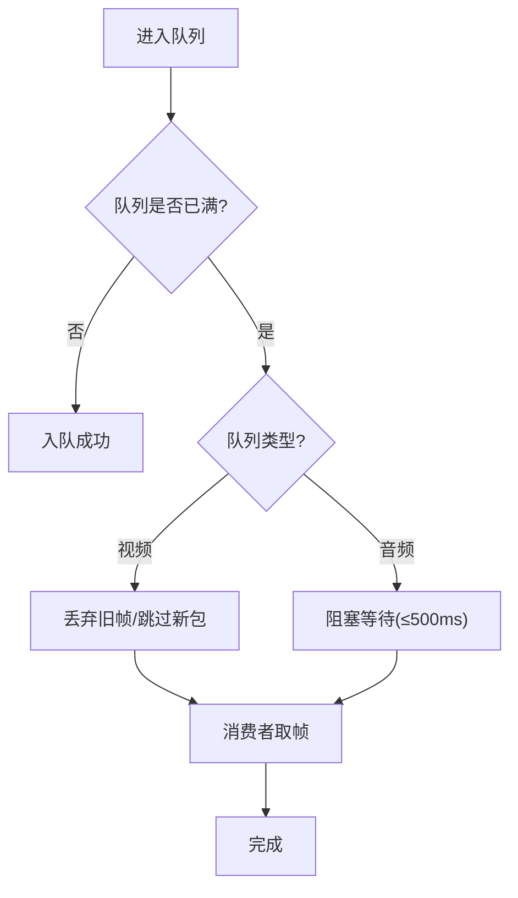
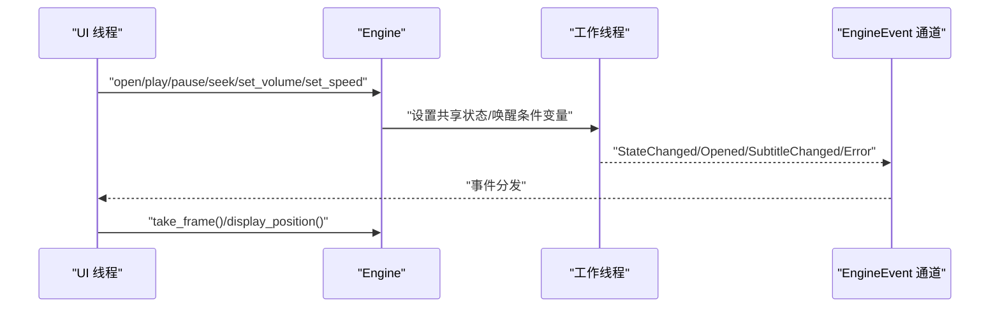
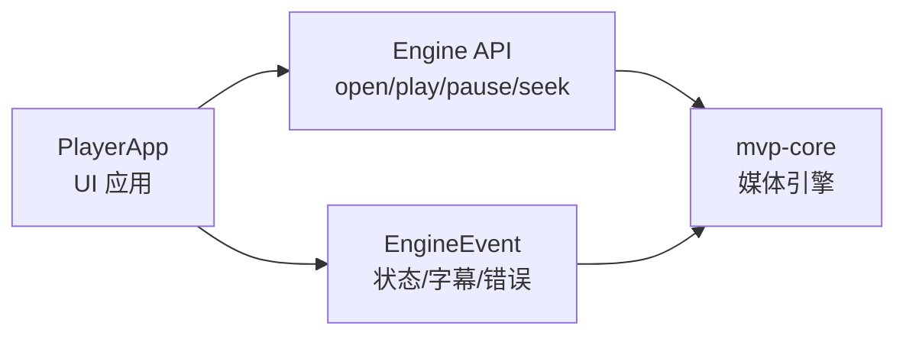
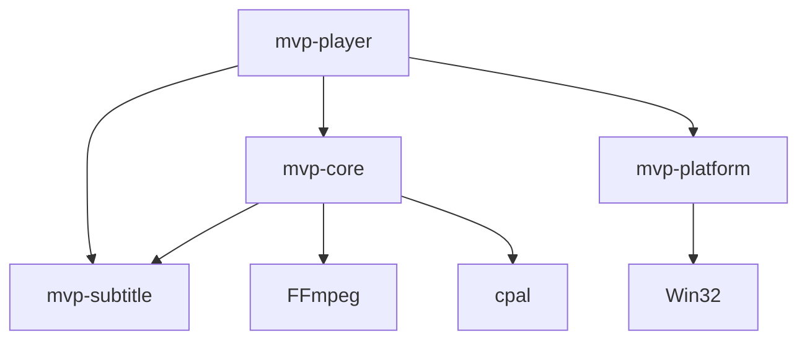

# 核心架构设计

<cite>
**本文引用的文件**   
- [Cargo.toml](file://Cargo.toml)
- [README.md](file://README.md)
- [mvp-core/Cargo.toml](file://crates/mvp-core/Cargo.toml)
- [mvp-platform/Cargo.toml](file://crates/mvp-platform/Cargo.toml)
- [mvp-subtitle/Cargo.toml](file://crates/mvp-subtitle/Cargo.toml)
- [mvp-player/Cargo.toml](file://crates/mvp-player/Cargo.toml)
- [mvp-core/src/lib.rs](file://crates/mvp-core/src/lib.rs)
- [mvp-core/src/engine.rs](file://crates/mvp-core/src/engine.rs)
- [mvp-core/src/engine/clock.rs](file://crates/mvp-core/src/engine/clock.rs)
- [mvp-core/src/engine/queue.rs](file://crates/mvp-core/src/engine/queue.rs)
- [mvp-core/src/engine/workers.rs](file://crates/mvp-core/src/engine/workers.rs)
- [mvp-core/src/audio.rs](file://crates/mvp-core/src/audio.rs)
- [mvp-core/src/video.rs](file://crates/mvp-core/src/video.rs)
- [mvp-subtitle/src/lib.rs](file://crates/mvp-subtitle/src/lib.rs)
- [mvp-subtitle/src/model.rs](file://crates/mvp-subtitle/src/model.rs)
- [mvp-platform/src/lib.rs](file://crates/mvp-platform/src/lib.rs)
- [mvp-platform/src/single_instance.rs](file://crates/mvp-platform/src/single_instance.rs)
- [mvp-platform/src/assoc.rs](file://crates/mvp-platform/src/assoc.rs)
- [mvp-player/src/main.rs](file://crates/mvp-player/src/main.rs)
- [mvp-player/src/app.rs](file://crates/mvp-player/src/app.rs)
</cite>

## 目录
1. [引言](#引言)
2. [项目结构](#项目结构)
3. [核心组件](#核心组件)
4. [架构总览](#架构总览)
5. [详细组件分析](#详细组件分析)
6. [依赖关系分析](#依赖关系分析)
7. [性能与并发特性](#性能与并发特性)
8. [故障排查指南](#故障排查指南)
9. [结论](#结论)

## 引言
本文件面向 MVP-Versatile-Player 的核心架构，聚焦四个 crate 的职责边界、播放管线线程模型、主时钟同步机制、队列与背压策略、事件驱动状态管理，以及 UI 层与引擎层的分离原则。目标是帮助开发者快速理解各模块如何协作，并在扩展或优化时保持系统稳定与可维护性。

## 项目结构
仓库采用 Rust workspace 组织，包含四个 crate：
- mvp-core：媒体引擎（FFmpeg 绑定、A/V 时钟、播放列表、图片查看器）
- mvp-platform：Windows 集成（文件关联、单实例 IPC、外壳、电源）
- mvp-subtitle：字幕解析（SRT / ASS / VTT / MicroDVD + 编码识别）
- mvp-player：egui 界面与应用程序入口

图表来源
- [Cargo.toml:1-8](file://Cargo.toml#L1-L8)
- [README.md:315-323](file://README.md#L315-L323)

章节来源
- [Cargo.toml:1-8](file://Cargo.toml#L1-L8)
- [README.md:315-323](file://README.md#L315-L323)

## 核心组件
- mvp-core
  - 职责：直接链接 FFmpeg，负责解复用、解码、色彩转换、重采样、HDR/杜比视界处理、音频输出、视频帧队列、播放列表与图片查看器模型。
  - 关键抽象：Engine、Clock、VideoQueue、AudioSink、RgbaConverter、FramePool。
- mvp-platform
  - 职责：Windows 平台能力封装，包括文件关联注册、单实例互斥体与隐藏窗口 IPC、任务栏/标题栏等外壳辅助、播放时阻止休眠、显示器与工作区测量。
- mvp-subtitle
  - 职责：纯逻辑字幕解析与时间轴查询，支持 SRT/ASS/WebVTT/MicroDVD，自动编码检测，提供 Cue 模型与 active_at/index_at 等查询接口。
- mvp-player
  - 职责：基于 eframe/egui 的 UI 应用，负责命令行解析、单实例协调、窗口与主题初始化、播放控制、GPU 纹理上传、设置持久化、IPC 消息分发。

章节来源
- [mvp-core/src/lib.rs:1-44](file://crates/mvp-core/src/lib.rs#L1-L44)
- [mvp-platform/src/lib.rs:1-34](file://crates/mvp-platform/src/lib.rs#L1-L34)
- [mvp-subtitle/src/lib.rs:1-59](file://crates/mvp-subtitle/src/lib.rs#L1-L59)
- [mvp-player/src/main.rs:1-14](file://crates/mvp-player/src/main.rs#L1-L14)

## 架构总览
播放管线由三个关键线程组成：解复用线程、视频解码线程、音频解码线程。数据流向如下：

图表来源
- [mvp-core/src/engine.rs:1-21](file://crates/mvp-core/src/engine.rs#L1-L21)
- [mvp-core/src/engine/workers.rs:134-146](file://crates/mvp-core/src/engine/workers.rs#L134-L146)
- [mvp-core/src/engine/queue.rs:67-86](file://crates/mvp-core/src/engine/queue.rs#L67-L86)
- [mvp-core/src/audio.rs:1-26](file://crates/mvp-core/src/audio.rs#L1-L26)

## 详细组件分析

### 播放管线与线程模型
- 解复用线程
  - 负责打开输入、探测媒体信息、选择音视频轨道、启动视频/音频解码线程、分发数据包、处理跳转与轨道切换、内嵌字幕解码与图形字幕位图缓存。
  - 控制指令通过共享状态下发，不走包队列，避免“丢弃全部”指令被积压在大量包之后。
- 视频解码线程
  - 接收视频包，进行硬件/软件解码、颜色空间转换、HDR/杜比视界映射、缩放，产出 RGBA 帧并放入视频帧队列。
- 音频解码线程
  - 接收音频包，进行重采样与音效增强，将 f32 样本块推送到 cpal 设备回调队列；设备回调线程零分配、无锁读取参数。

图表来源
- [mvp-core/src/engine/workers.rs:281-687](file://crates/mvp-core/src/engine/workers.rs#L281-L687)

章节来源
- [mvp-core/src/engine/workers.rs:134-146](file://crates/mvp-core/src/engine/workers.rs#L134-L146)
- [mvp-core/src/engine/workers.rs:281-687](file://crates/mvp-core/src/engine/workers.rs#L281-L687)

### 主时钟同步机制
- 双源时间基准
  - 音频时钟：以声卡实际消费为准，保证 A/V 同步。
  - 墙钟：用于音频未启动、纯视频文件或音频停滞时的时间推进。
- 系统时钟作为主时钟的原因
  - 声卡计数器报告的是“写入量”，并非“播放位置”；某些驱动一次吞掉整秒音频或在停止回调后继续播放缓冲数据，导致基于设备的时钟速度异常。
  - 系统时钟单调且精确，代价是两晶振之间的漂移（真实硬件几十 ppm，电影累计几百毫秒），远优于一个“根本不准”的时钟。
- 锚点与漂移处理
  - 首次音频数据建立锚点（anchor_pts/anchor_ns），后续根据 elapsed * speed 计算位置。
  - 暂停时冻结时间推进，恢复时补偿暂停时长，避免跳变。
  - 当音频流出现不连续（如 seek/换轨）时，显式 flush 重置锚点，避免误判为漂移。

图表来源
- [mvp-core/src/engine/clock.rs:1-159](file://crates/mvp-core/src/engine/clock.rs#L1-L159)
- [mvp-core/src/audio.rs:504-618](file://crates/mvp-core/src/audio.rs#L504-L618)

章节来源
- [mvp-core/src/engine/clock.rs:1-159](file://crates/mvp-core/src/engine/clock.rs#L1-L159)
- [mvp-core/src/audio.rs:1-26](file://crates/mvp-core/src/audio.rs#L1-L26)
- [mvp-core/src/audio.rs:504-618](file://crates/mvp-core/src/audio.rs#L504-L618)

### 队列管理与背压机制
- 视频队列
  - 按字节预算与帧数双重限制，同时支持“媒体秒数”的时间预算，防止高码率/高分辨率下内存暴涨。
  - try_push 在满时返回原帧，不会丢弃最旧的帧；take_ready 会丢弃已过期帧，避免越落越后。
  - 解复用线程在视频队列落后于时钟一定阈值时直接丢弃新包，因为旧帧已过时，展示只会更晚。
- 音频队列
  - 使用 crossbeam 有界通道，push 最多阻塞 500 ms 实现背压，避免丢音；关闭时立即中断等待，确保退出迅速。
  - 设备回调线程零分配、无锁读取音量/静音/增强参数，实时安全。
- 为什么视频丢包而音频保持背压
  - 视频可以牺牲（画面延迟可接受），音频不能断（声音连续性优先）。
  - 解复用线程是唯一的数据源，若因视频队列满而永久阻塞，会导致音频也饿死；因此对视频采用“落后即丢”的策略，对音频采用“阻塞等待”策略。

图表来源
- [mvp-core/src/engine/queue.rs:67-253](file://crates/mvp-core/src/engine/queue.rs#L67-L253)
- [mvp-core/src/engine/workers.rs:201-279](file://crates/mvp-core/src/engine/workers.rs#L201-L279)
- [mvp-core/src/audio.rs:519-575](file://crates/mvp-core/src/audio.rs#L519-L575)

章节来源
- [mvp-core/src/engine/queue.rs:67-253](file://crates/mvp-core/src/engine/queue.rs#L67-L253)
- [mvp-core/src/engine/workers.rs:201-279](file://crates/mvp-core/src/engine/workers.rs#L201-L279)
- [mvp-core/src/audio.rs:519-575](file://crates/mvp-core/src/audio.rs#L519-L575)

### 事件驱动的状态管理
- EngineEvent
  - 文件打开成功、生命周期状态变化、字幕可用、图形字幕可用、播放结束、错误通知。
- Shared 状态
  - 使用原子变量与小 Mutex 传递控制指令（跳转、轨道切换、音量/静音、速率、AB 循环、HDR/杜比视界开关等），避免控制消息被积压在数据包中。
- UI 与引擎分离
  - UI 仅订阅 EngineEvent 与快照（EngineSnapshot），不直接操作解码细节；引擎内部线程捕获 panic，损坏文件只转为错误状态，不影响整个播放器。

图表来源
- [mvp-core/src/engine.rs:138-153](file://crates/mvp-core/src/engine.rs#L138-L153)
- [mvp-core/src/engine.rs:310-372](file://crates/mvp-core/src/engine.rs#L310-L372)
- [mvp-core/src/engine.rs:537-661](file://crates/mvp-core/src/engine.rs#L537-L661)

章节来源
- [mvp-core/src/engine.rs:138-153](file://crates/mvp-core/src/engine.rs#L138-L153)
- [mvp-core/src/engine.rs:310-372](file://crates/mvp-core/src/engine.rs#L310-L372)
- [mvp-core/src/engine.rs:537-661](file://crates/mvp-core/src/engine.rs#L537-L661)

### UI 层与引擎层分离设计
- UI 层（mvp-player）
  - 负责命令行解析、单实例协调、窗口与主题初始化、播放控制、GPU 纹理上传、设置持久化、IPC 消息分发。
  - 通过 Engine::open/play/pause/seek 等 API 控制引擎，并通过 EngineEvent 与 EngineSnapshot 观察状态。
- 引擎层（mvp-core）
  - 负责媒体 I/O、解码、时钟、队列、音频输出、字幕解析与渲染数据准备。
  - 对外暴露稳定的 API 与事件，屏蔽多线程与 FFmpeg 细节。

图表来源
- [mvp-player/src/app.rs:65-204](file://crates/mvp-player/src/app.rs#L65-L204)
- [mvp-player/src/app.rs:484-544](file://crates/mvp-player/src/app.rs#L484-L544)
- [mvp-core/src/engine.rs:537-661](file://crates/mvp-core/src/engine.rs#L537-L661)

章节来源
- [mvp-player/src/app.rs:65-204](file://crates/mvp-player/src/app.rs#L65-L204)
- [mvp-player/src/app.rs:484-544](file://crates/mvp-player/src/app.rs#L484-L544)
- [mvp-core/src/engine.rs:537-661](file://crates/mvp-core/src/engine.rs#L537-L661)

## 依赖关系分析
- mvp-player 依赖 mvp-core、mvp-platform、mvp-subtitle
- mvp-core 依赖 mvp-subtitle、FFmpeg、cpal、image
- mvp-platform 仅在 Windows 上启用平台相关功能，其他平台提供空实现
- mvp-subtitle 无外部媒体依赖，纯逻辑库

图表来源
- [mvp-player/Cargo.toml:32-34](file://crates/mvp-player/Cargo.toml#L32-L34)
- [mvp-core/Cargo.toml:22-25](file://crates/mvp-core/Cargo.toml#L22-L25)
- [mvp-platform/Cargo.toml:14-39](file://crates/mvp-platform/Cargo.toml#L14-L39)

章节来源
- [mvp-player/Cargo.toml:32-34](file://crates/mvp-player/Cargo.toml#L32-L34)
- [mvp-core/Cargo.toml:22-25](file://crates/mvp-core/Cargo.toml#L22-L25)
- [mvp-platform/Cargo.toml:14-39](file://crates/mvp-platform/Cargo.toml#L14-L39)

## 性能与并发特性
- 启动速度
  - 窗口出现前只做三件事：解析命令行、写单实例互斥体、读中文字体；FFmpeg 表懒加载，声卡在首次播放才打开。
- 关闭速度
  - 不清理积压：解复用的 abort 标志在每个工作线程循环顶部检查，剩余包直接丢弃；声卡 close 后立即中断背压等待；写设置很便宜。
- 解码与渲染
  - 视频帧池化缓冲区，减少分配；GPU 着色器一次性采样，不复制纹理；像素只拷贝一次（swscale 直接写入池化缓冲区，UI 零拷贝解释为 ColorImage）。
- 音频路径
  - 设备回调线程零分配、无锁读取参数；音量平滑过渡，避免爆音；增强链在回调线程内执行，参数通过 seqlock 发布。

章节来源
- [README.md:425-453](file://README.md#L425-L453)
- [mvp-core/src/video.rs:57-142](file://crates/mvp-core/src/video.rs#L57-L142)
- [mvp-core/src/audio.rs:320-461](file://crates/mvp-core/src/audio.rs#L320-L461)

## 故障排查指南
- 常见错误与定位
  - FFmpeg 初始化失败：检查 ffmpeg_next 绑定与开发包路径。
  - 音频设备不可用：记录日志中的设备枚举与默认配置，必要时切换到 48 kHz 稳定配置。
  - 解码无输出：超过 12 秒无帧则报“解码无输出”，检查容器探测与轨道选择。
  - 跳转自死锁：MPEG-TS 无索引跳转走二分查找，回调可能打回自身；代码已修复，若仍卡顿需检查 seek_request 与 interrupt 回调。
- 日志与诊断
  - 发布版本无控制台，日志写入 %APPDATA%\MVP-Versatile-Player\mvp.log，菜单「帮助 → 查看运行日志」可直接打开。
  - 使用示例 seek_probe 打印打开→解码→跳转→停止每一步时间戳，配合 RUST_LOG=mvp_core=debug 查看内部细节。

章节来源
- [mvp-core/src/lib.rs:57-69](file://crates/mvp-core/src/lib.rs#L57-L69)
- [mvp-core/src/engine/workers.rs:93-102](file://crates/mvp-core/src/engine/workers.rs#L93-L102)
- [README.md:435-453](file://README.md#L435-L453)
- [README.md:538-544](file://README.md#L538-L544)

## 结论
MVP-Versatile-Player 通过清晰的 crate 边界与线程模型，实现了高性能、低延迟、强鲁棒性的播放体验。核心在于：
- 解复用与解码分离，避免慢视频拖垮音频；
- 系统时钟为主时钟，结合音频锚点与漂移容忍；
- 视频队列“落后即丢”，音频队列“阻塞背压”；
- 事件驱动状态管理，UI 与引擎严格分离；
- 平台能力封装，保证 Windows 原生体验与可移植性。

这些设计共同确保了播放器在复杂媒体场景下的稳定性与响应性，并为后续扩展（如 HDR 着色器、Dolby Vision 增强层）提供了清晰的基础。