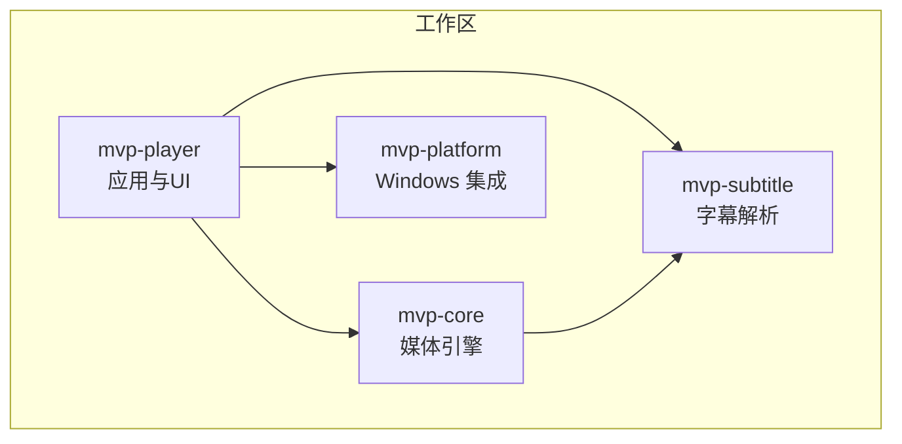
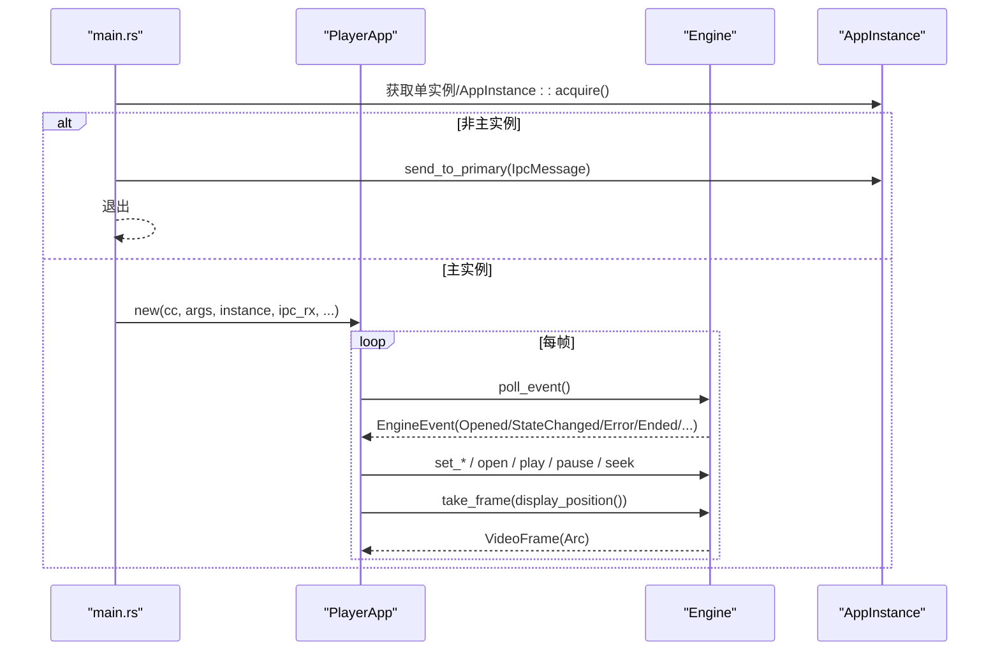
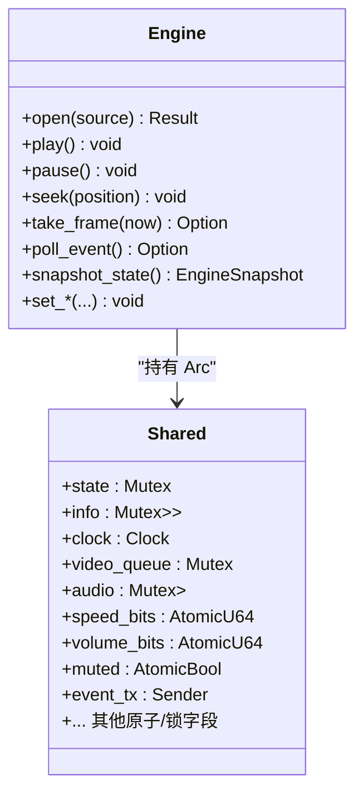
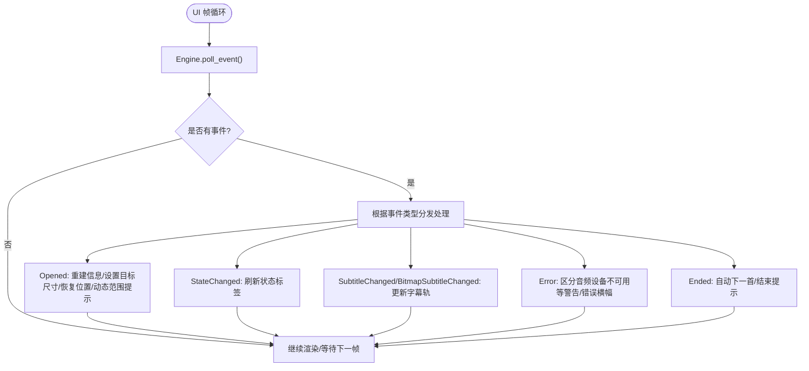
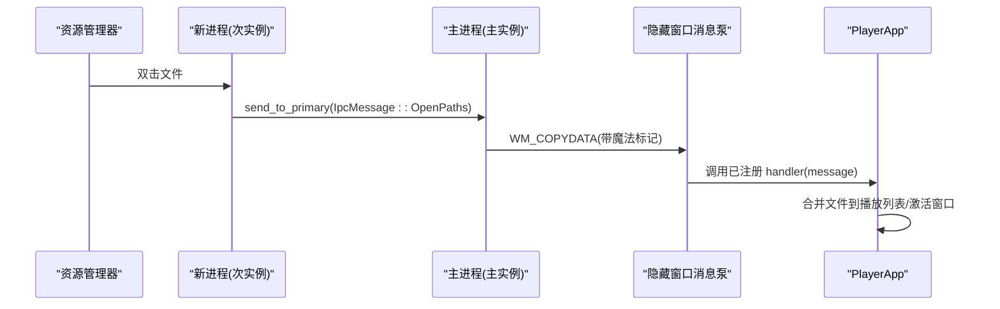
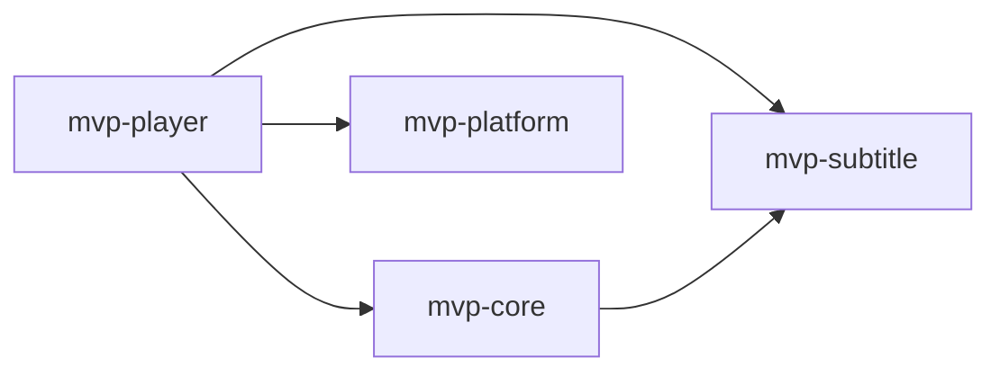

# 组件交互模式

<cite>
**本文引用的文件**   
- [Cargo.toml](file://Cargo.toml)
- [mvp-core/lib.rs](file://crates/mvp-core/src/lib.rs)
- [mvp-core/error.rs](file://crates/mvp-core/src/error.rs)
- [mvp-core/engine.rs](file://crates/mvp-core/src/engine.rs)
- [mvp-platform/lib.rs](file://crates/mvp-platform/src/lib.rs)
- [mvp-platform/single_instance.rs](file://crates/mvp-platform/src/single_instance.rs)
- [mvp-platform/assoc.rs](file://crates/mvp-platform/src/assoc.rs)
- [mvp-player/main.rs](file://crates/mvp-player/src/main.rs)
- [mvp-player/app.rs](file://crates/mvp-player/src/app.rs)
- [mvp-player/state.rs](file://crates/mvp-player/src/state.rs)
- [mvp-subtitle/lib.rs](file://crates/mvp-subtitle/src/lib.rs)
</cite>

## 目录
1. [引言](#引言)
2. [项目结构](#项目结构)
3. [核心组件](#核心组件)
4. [架构总览](#架构总览)
5. [详细组件分析](#详细组件分析)
6. [依赖关系分析](#依赖关系分析)
7. [性能与并发特性](#性能与并发特性)
8. [错误处理与异常传播](#错误处理与异常传播)
9. [Windows 平台集成交互模式](#windows-平台集成交互模式)
10. [结论](#结论)
11. [附录：最佳实践清单](#附录最佳实践清单)

## 引言
本文件系统性梳理 MVP-Versatile-Player 的组件交互模式，覆盖跨 crate 通信、多线程状态同步、事件驱动架构、UI 与引擎解耦、Windows 平台集成（单实例、文件关联、IPC），以及错误处理与异常隔离策略。目标是帮助读者快速理解各 crate 的职责边界、数据流与控制流，并给出可操作的实现要点与最佳实践。

## 项目结构
项目采用 Rust workspace 组织四个 crate：
- mvp-core：媒体引擎，封装 FFmpeg 解码、队列、时钟、音频输出、字幕与图像查看等能力。
- mvp-platform：Windows 平台集成（文件关联、单实例 IPC、系统托盘/任务栏辅助、电源与显示器信息）。
- mvp-player：应用层 UI（egui/eframe），编排播放、设置、主题、截图、缩略图缓存等。
- mvp-subtitle：纯逻辑字幕解析与时间轴查询，无平台依赖。

图表来源
- [Cargo.toml:1-8](file://Cargo.toml#L1-L8)

章节来源
- [Cargo.toml:1-8](file://Cargo.toml#L1-L8)

## 核心组件
- 媒体引擎 Engine：提供打开/关闭、播放/暂停、seek、帧拉取、事件轮询、快照等 API；内部维护 demuxer/decoder/queue/clock/audio sink 等多线程流水线。
- UI 应用 PlayerApp：持有 Engine、Playlist、Settings、UiState 等，是 UI 与引擎之间的唯一协调者。
- 平台能力 AppInstance：负责单实例互斥、隐藏窗口 IPC、消息分发到主进程。
- 字幕 Subtitle：纯文本/图形字幕解析模型，供引擎与 UI 复用。
- 错误类型 MediaError：统一封装 FFmpeg、IO、设备、不支持等错误。

章节来源
- [mvp-core/engine.rs:1-45](file://crates/mvp-core/src/engine.rs#L1-L45)
- [mvp-player/app.rs:1-20](file://crates/mvp-player/src/app.rs#L1-L20)
- [mvp-platform/single_instance.rs:1-62](file://crates/mvp-platform/src/single_instance.rs#L1-L62)
- [mvp-subtitle/lib.rs:1-60](file://crates/mvp-subtitle/src/lib.rs#L1-L60)
- [mvp-core/error.rs:1-53](file://crates/mvp-core/src/error.rs#L1-L53)

## 架构总览
整体采用“UI 命令 + 引擎事件”的事件驱动架构：
- UI 通过 Engine 的 set_* 方法下发控制命令（速度、音量、轨道、目标尺寸、外部字幕等）。
- 引擎在后台线程完成 demux/decode/render，并通过 bounded channel 推送 EngineEvent 给 UI。
- UI 每帧 poll_event() 消费事件，更新 UI 状态与渲染管线。
- 平台层通过 AppInstance 提供单实例与 IPC，将二次启动的文件列表转发给主实例。

图表来源
- [mvp-player/main.rs:69-181](file://crates/mvp-player/src/main.rs#L69-L181)
- [mvp-player/app.rs:859-889](file://crates/mvp-player/src/app.rs#L859-L889)
- [mvp-core/engine.rs:1240-1243](file://crates/mvp-core/src/engine.rs#L1240-L1243)
- [mvp-platform/single_instance.rs:154-169](file://crates/mvp-platform/src/single_instance.rs#L154-L169)

## 详细组件分析

### 跨 crate 通信与 API 设计
- mvp-player → mvp-core：通过 Engine 暴露的 open/play/pause/seek/take_frame/snapshot_state/set_* 等方法进行控制与数据拉取；通过 EngineEvent 接收异步通知。
- mvp-player → mvp-platform：使用 AppInstance 管理单实例，IpcMessage 作为跨进程消息体。
- mvp-core → mvp-subtitle：引擎直接消费 Subtitle 模型用于字幕显示与选择。
- mvp-core 内部：demuxer/decoder/queue/clock/audio sink 之间通过 bounded channel 和共享原子/锁保护的状态协作。

章节来源
- [mvp-core/engine.rs:138-153](file://crates/mvp-core/src/engine.rs#L138-L153)
- [mvp-player/app.rs:234-263](file://crates/mvp-player/src/app.rs#L234-L263)
- [mvp-platform/single_instance.rs:54-62](file://crates/mvp-platform/src/single_instance.rs#L54-L62)
- [mvp-subtitle/lib.rs:1-60](file://crates/mvp-subtitle/src/lib.rs#L1-L60)

### 多线程状态同步机制
- 共享状态 Shared：集中存放 PlaybackState、MediaInfo、Clock、VideoQueue、AudioSink、Subtitle、参数原子位等。
- 读写保护：
  - 关键可变状态使用 parking_lot::Mutex 保护（如 state、info、duration、video_queue、subtitle、audio 等）。
  - 高频读写的标量使用 std::sync::atomic（如 speed_bits、volume_bits、muted、looping、hw_decoding、hdr_tone_map、dv_reshape、ab_loop 等）避免锁竞争。
  - 条件变量 Condvar 用于视频队列空间唤醒。
- 无锁/低锁路径：
  - 控制信号（速度、音量、静音、轨道选择、HDR/DV 开关）通过原子位或整型字段传递，worker 侧读取，避免阻塞通道。
  - 帧队列有字节数、帧数、时长三重上限，防止内存膨胀与延迟失控。

图表来源
- [mvp-core/engine.rs:310-372](file://crates/mvp-core/src/engine.rs#L310-L372)
- [mvp-core/engine.rs:529-549](file://crates/mvp-core/src/engine.rs#L529-L549)

章节来源
- [mvp-core/engine.rs:310-372](file://crates/mvp-core/src/engine.rs#L310-L372)
- [mvp-core/engine.rs:529-549](file://crates/mvp-core/src/engine.rs#L529-L549)

### 事件驱动架构
- 事件定义 EngineEvent：Opened、StateChanged、SubtitleChanged、BitmapSubtitleChanged、Ended、Error。
- 事件生产：引擎在工作线程中构造并发送事件至 bounded channel。
- 事件消费：UI 每帧 poll_event()，按类型更新 UI 状态、重建信息行、处理错误提示、推进播放列表等。

图表来源
- [mvp-core/engine.rs:138-153](file://crates/mvp-core/src/engine.rs#L138-L153)
- [mvp-player/app.rs:859-889](file://crates/mvp-player/src/app.rs#L859-L889)

章节来源
- [mvp-core/engine.rs:138-153](file://crates/mvp-core/src/engine.rs#L138-L153)
- [mvp-player/app.rs:859-889](file://crates/mvp-player/src/app.rs#L859-L889)

### UI 与引擎的解耦设计
- 命令模式：UI 通过 Engine.set_* 下发命令（速度、音量、轨道、HDR/DV、目标尺寸、A-B 循环、外部字幕等），不直接访问底层 FFmpeg。
- 观察者模式：Engine 通过 EngineEvent 主动通知 UI，UI 订阅并响应。
- 帧所有权：take_frame 返回 Arc<VideoFrame>，且保证 UI 是唯一所有者，便于零拷贝上传 GPU。

章节来源
- [mvp-core/engine.rs:1104-1115](file://crates/mvp-core/src/engine.rs#L1104-L1115)
- [mvp-core/engine.rs:1190-1230](file://crates/mvp-core/src/engine.rs#L1190-L1230)
- [mvp-player/app.rs:715-769](file://crates/mvp-player/src/app.rs#L715-L769)

### Windows 平台集成交互模式
- 单实例控制：
  - 主实例通过命名互斥量 Acquire，失败则作为次实例通过 WM_COPYDATA 向主实例发送 IpcMessage（Activate/OpenPaths/Quit）。
  - 主实例在独立线程维护隐藏窗口消息泵，安全分发给已注册的 Handler。
- 文件关联：
  - 仅写入 HKEY_CURRENT_USER，无需 UAC；支持 Capabilities 注册与经典 Classes 默认值尝试；Win8+ 需用户确认。
- 系统托盘/任务栏：
  - 设置 AppUserModelID，使任务栏分组与跳转列表生效；dark title bar、标题着色等由 shell 模块提供。

图表来源
- [mvp-platform/single_instance.rs:154-169](file://crates/mvp-platform/src/single_instance.rs#L154-L169)
- [mvp-platform/single_instance.rs:658-715](file://crates/mvp-platform/src/single_instance.rs#L658-L715)
- [mvp-player/main.rs:69-181](file://crates/mvp-player/src/main.rs#L69-L181)

章节来源
- [mvp-platform/single_instance.rs:1-169](file://crates/mvp-platform/src/single_instance.rs#L1-L169)
- [mvp-platform/assoc.rs:1-21](file://crates/mvp-platform/src/assoc.rs#L1-L21)
- [mvp-platform/assoc.rs:343-441](file://crates/mvp-platform/src/assoc.rs#L343-L441)
- [mvp-player/main.rs:65-68](file://crates/mvp-player/src/main.rs#L65-L68)

## 依赖关系分析
- mvp-player 依赖 mvp-core、mvp-platform、mvp-subtitle。
- mvp-core 依赖 mvp-subtitle（字幕模型）、FFmpeg、cpal、image 等。
- mvp-platform 仅在 Windows 下启用具体实现，非 Windows 提供 no-op stub。

图表来源
- [Cargo.toml:1-8](file://Cargo.toml#L1-L8)

章节来源
- [Cargo.toml:1-8](file://Cargo.toml#L1-L8)

## 性能与并发特性
- 帧队列三重限制：字节预算、帧数量、媒体秒数，防止高码率/高分辨率导致内存与延迟失控。
- 零拷贝帧上传：take_frame 返回的唯一 Arc 被 UI 直接 reinterpret 为 ColorImage 并上传 GPU，避免额外拷贝。
- 原子参数通道：速度、音量、静音、轨道选择、HDR/DV 等通过原子位传递，worker 侧读取，避免阻塞通道。
- 停止流程有界：stop 先置 abort 标志、唤醒等待中的 worker、关闭音频设备，再 join 线程，确保关闭窗口快速响应。
- 日志滚动：主进程日志按运行内字节预算滚动，避免长时间运行撑爆磁盘。

章节来源
- [mvp-core/engine.rs:174-213](file://crates/mvp-core/src/engine.rs#L174-L213)
- [mvp-core/engine.rs:1190-1230](file://crates/mvp-core/src/engine.rs#L1190-L1230)
- [mvp-core/engine.rs:613-661](file://crates/mvp-core/src/engine.rs#L613-L661)
- [mvp-player/main.rs:184-294](file://crates/mvp-player/src/main.rs#L184-L294)

## 错误处理与异常传播
- 引擎错误类型 MediaError：统一封装 FFmpeg、IO、Unsupported、MissingStream、AudioDevice、Image、Cancelled、Other。
- 事件化错误：引擎将错误以 EngineEvent::Error 形式推送到 UI，UI 区分“音频设备不可用”等场景为 Toast 警告而非阻断性错误横幅。
- 崩溃隔离：
  - 工作线程 panic 被捕获并转为错误状态，损坏文件不会拖垮整个播放器。
  - IPC 处理器 panic 被 catch_unwind 包裹，记录日志并丢弃该消息，保持 IPC 线程存活。
- 停止与清理：stop 对线程 join 加超时，避免卡死；Drop 中再次保障 stop 执行。

章节来源
- [mvp-core/error.rs:1-53](file://crates/mvp-core/src/error.rs#L1-L53)
- [mvp-player/app.rs:877-884](file://crates/mvp-player/src/app.rs#L877-L884)
- [mvp-core/lib.rs:16-17](file://crates/mvp-core/src/lib.rs#L16-L17)
- [mvp-platform/single_instance.rs:317-331](file://crates/mvp-platform/src/single_instance.rs#L317-L331)
- [mvp-core/engine.rs:1302-1346](file://crates/mvp-core/src/engine.rs#L1302-L1346)

## Windows 平台集成交互模式
- 单实例与 IPC：
  - 主实例创建命名互斥量与隐藏窗口，次实例通过 FindWindowW + WM_COPYDATA 发送消息，带魔法标记 dwData 防误解析。
  - 主实例的 IPC 线程独立消息泵，Handler 安装于进程全局 RwLock，panic 被捕获。
- 文件关联：
  - 仅写 HKCU，支持 Capabilities 与 OpenWithProgids；Win8+ 需要用户确认 Default apps。
  - 提供 open_default_apps_settings 深链直达设置页。
- 系统托盘/任务栏：
  - 设置 AppUserModelID，配合 eframe 窗口选项，使任务栏分组与跳转列表正常。

章节来源
- [mvp-platform/single_instance.rs:1-169](file://crates/mvp-platform/src/single_instance.rs#L1-L169)
- [mvp-platform/single_instance.rs:337-715](file://crates/mvp-platform/src/single_instance.rs#L337-L715)
- [mvp-platform/assoc.rs:1-21](file://crates/mvp-platform/src/assoc.rs#L1-L21)
- [mvp-platform/assoc.rs:413-441](file://crates/mvp-platform/src/assoc.rs#L413-L441)
- [mvp-player/main.rs:65-68](file://crates/mvp-player/src/main.rs#L65-L68)

## 结论
本项目通过清晰的 crate 分层与明确的 API 契约，实现了 UI 与引擎的解耦、跨进程的单实例控制、稳定的多线程状态同步与事件驱动的数据流。错误处理与异常隔离贯穿全链路，确保单个组件故障不影响整体稳定性。结合原子参数、有界队列与零拷贝帧上传，系统在高性能与用户体验之间取得良好平衡。

## 附录：最佳实践清单
- 控制面走原子/小锁：高频参数变更使用原子位，避免阻塞通道与锁竞争。
- 事件驱动：所有跨线程状态变更通过 EngineEvent 通知 UI，UI 只消费不直写。
- 帧所有权：take_frame 返回的唯一 Arc 必须直接上传 GPU，禁止在引擎侧保留引用。
- 有界队列：始终设置字节/帧/时长上限，防止极端媒体导致内存与延迟爆炸。
- 停止流程：先置 abort、唤醒等待、关闭设备，再 join 线程，确保 UI 关闭即时响应。
- IPC 健壮性：消息带魔法标记，发送方使用 SendMessageTimeout，接收方 catch_unwind 包裹 handler。
- 文件关联：优先使用 HKCU 注册，必要时引导用户到 Default apps 页面确认。