# 项目介绍与特性

<cite>
**本文引用的文件**   
- [README.md](file://README.md)
- [Cargo.toml](file://Cargo.toml)
- [mvp-core/Cargo.toml](file://crates/mvp-core/Cargo.toml)
- [mvp-platform/Cargo.toml](file://crates/mvp-platform/Cargo.toml)
- [mvp-subtitle/Cargo.toml](file://crates/mvp-subtitle/Cargo.toml)
- [mvp-player/Cargo.toml](file://crates/mvp-player/Cargo.toml)
- [mvp-core/src/lib.rs](file://crates/mvp-core/src/lib.rs)
- [mvp-platform/src/lib.rs](file://crates/mvp-platform/src/lib.rs)
- [mvp-subtitle/src/lib.rs](file://crates/mvp-subtitle/src/lib.rs)
- [mvp-player/src/main.rs](file://crates/mvp-player/src/main.rs)
</cite>

## 目录
1. [简介](#简介)
2. [项目结构](#项目结构)
3. [核心功能概览](#核心功能概览)
4. [架构总览](#架构总览)
5. [模块职责详解](#模块职责详解)
6. [播放管线与多线程架构](#播放管线与多线程架构)
7. [HDR 与杜比视界支持](#hdr-与杜比视界支持)
8. [音效增强系统](#音效增强系统)
9. [字幕与图形字幕](#字幕与图形字幕)
10. [Windows 集成与使用体验](#windows-集成与使用体验)
11. [系统要求、依赖与支持的格式](#系统要求依赖与支持的格式)
12. [性能与启动优化](#性能与启动优化)
13. [已知限制与下一步工作](#已知限制与下一步工作)
14. [常见问题排查](#常见问题排查)
15. [总结](#总结)

## 简介
MVP-Versatile-Player 是一个面向 Windows 桌面、对标 VLC 与 PotPlayer 使用习惯的多功能多媒体播放器。它用 Rust 编写，直接链接 FFmpeg 内核，而不是通过 `ffmpeg.exe` 子进程调用；这一设计消除了管道预热延迟，让「双击媒体文件即开始播放」的体验更贴近原生应用。

项目同时覆盖视频、音频、图片与网络串流，提供完整的播放列表、字幕、画面调节、音效增强、HDR/杜比视界处理、GPU 渲染以及 Windows 系统集成能力。仓库采用 Cargo workspace 组织为四个主要模块：`mvp-core`（媒体引擎）、`mvp-platform`（Windows 集成）、`mvp-subtitle`（字幕解析）和 `mvp-player`（egui 界面与应用入口）。

## 项目结构
仓库根目录是 Cargo workspace，核心代码集中在 `crates/` 下：

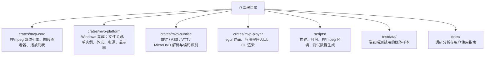

**图表来源**
- [README.md:315-323](file://README.md#L315-L323)
- [README.md:595-609](file://README.md#L595-L609)

**章节来源**
- [README.md:315-323](file://README.md#L315-L323)
- [README.md:595-609](file://README.md#L595-L609)

## 核心功能概览
MVP-Versatile-Player 的核心能力可以按用户视角分为播放、画质、音效、字幕、图片与系统集成六类：

| 类别 | 关键能力 | 技术要点 |
|---|---|---|
| 播放 | 直接链接 FFmpeg、硬件解码回退软件解码、音视频分离线程、精确跳转、逐帧步进、A–B 循环、随机播放、断点续播 | 解复用线程 + 视频/音频/字幕工作线程；队列按字节数上限控制 |
| HDR/色彩 | HDR10、BT.2020、PQ/HLG、杜比视界配置记录与 RPU 元数据读取、色调映射、色彩矩阵按元数据选择 | `dolby.rs`、`hdr.rs`、`video.rs` 中的像素转换与颜色空间判断 |
| 音效增强 | 十段均衡器、低音与清晰度、响度归一化、峰值限制器、中侧立体声宽度、Schroeder 残响 | cpal 回调线程内无锁参数更新，关闭时旁路保证零开销 |
| 字幕 | SRT、ASS/SSA、WebVTT、MicroDVD、PGS/VobSub/DVB 图形字幕、自动编码识别 | `mvp-subtitle` 纯逻辑库，GBK/Big5/Shift_JIS/UTF-16 BOM 等兼容 |
| 图片 | PNG/JPEG/GIF/WebP/BMP/TIFF/ICO/TGA/AVIF/JXL/QOI/PNM/EXR、动画帧播放、EXIF 方向旋转 | `image_view.rs` 与 GPU 纹理适配 |
| Windows 集成 | 右键「打开方式」、一键文件关联、单实例、深色标题栏、阻止休眠、任务栏图标 | `mvp-platform` 封装注册表、DPI、电源状态与 IPC |

**章节来源**
- [README.md:23-149](file://README.md#L23-L149)

## 架构总览
从高层看，MVP-Versatile-Player 的架构由「界面层 → 平台集成层 → 媒体引擎层 → FFmpeg 内核」组成：

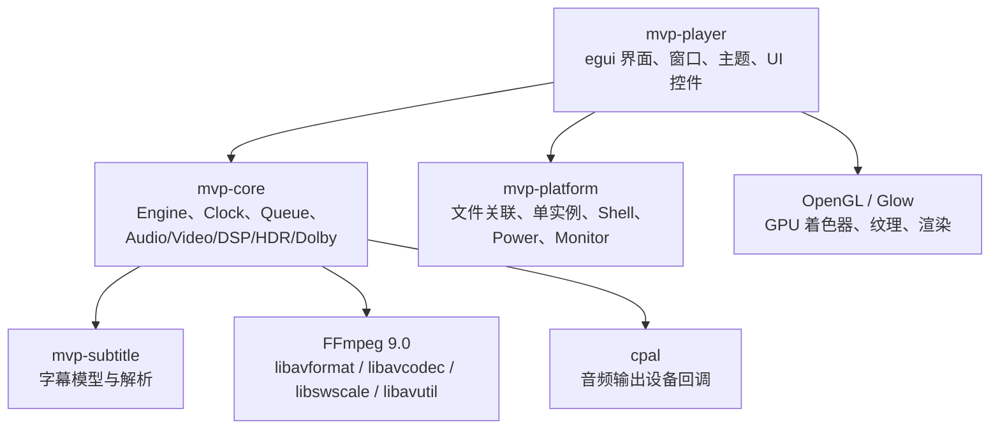

**图表来源**
- [README.md:315-357](file://README.md#L315-L357)
- [mvp-player/Cargo.toml:13-34](file://crates/mvp-player/Cargo.toml#L13-L34)
- [mvp-core/Cargo.toml:8-25](file://crates/mvp-core/Cargo.toml#L8-L25)
- [Cargo.toml:36-50](file://Cargo.toml#L36-L50)

**章节来源**
- [README.md:315-357](file://README.md#L315-L357)
- [Cargo.toml:1-8](file://Cargo.toml#L1-L8)

## 模块职责详解

### mvp-core：媒体引擎
`mvp-core` 是播放器的核心，负责直接绑定 FFmpeg，完成解复用、解码、色彩转换、重采样、图像查看、播放列表、时钟、队列、DSP 音效、HDR 与杜比视界处理。

关键职责包括：
- 懒初始化 FFmpeg，避免启动阶段做昂贵操作。
- 暴露 `Engine`、`Clock`、`MediaSource`、`PlaybackState` 等播放控制接口。
- 管理视频帧池、RGBA 转换器、音频缓冲与字幕模型。
- 导出杜比视界计划、信号、RPU、渲染策略与 HDR 信息。
- 提供图片文档、帧、视图与 EXIF 方向处理。
- 提供播放列表、媒体信息与错误类型。

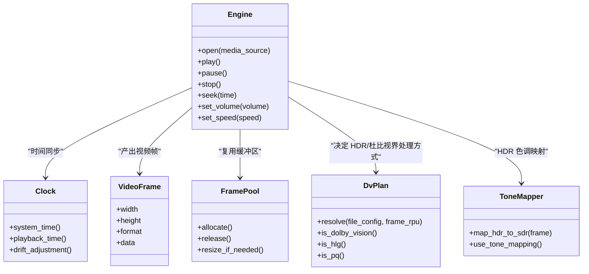

**图表来源**
- [mvp-core/src/lib.rs:1-43](file://crates/mvp-core/src/lib.rs#L1-L43)
- [README.md:325-357](file://README.md#L325-L357)

**章节来源**
- [mvp-core/src/lib.rs:1-43](file://crates/mvp-core/src/lib.rs#L1-L43)
- [mvp-core/Cargo.toml:1-25](file://crates/mvp-core/Cargo.toml#L1-L25)

### mvp-platform：Windows 集成
`mvp-platform` 隔离所有 Windows 相关胶水代码，包括：
- 文件关联与注册表能力注册。
- 单实例守护与 `WM_COPYDATA` IPC。
- Shell 辅助：AppUserModelID、深色标题栏、任务栏闪烁、资源管理器集成。
- 播放期间阻止屏幕休眠。
- 显示器工作区与 DPI 测量，用于窗口尺寸定位。

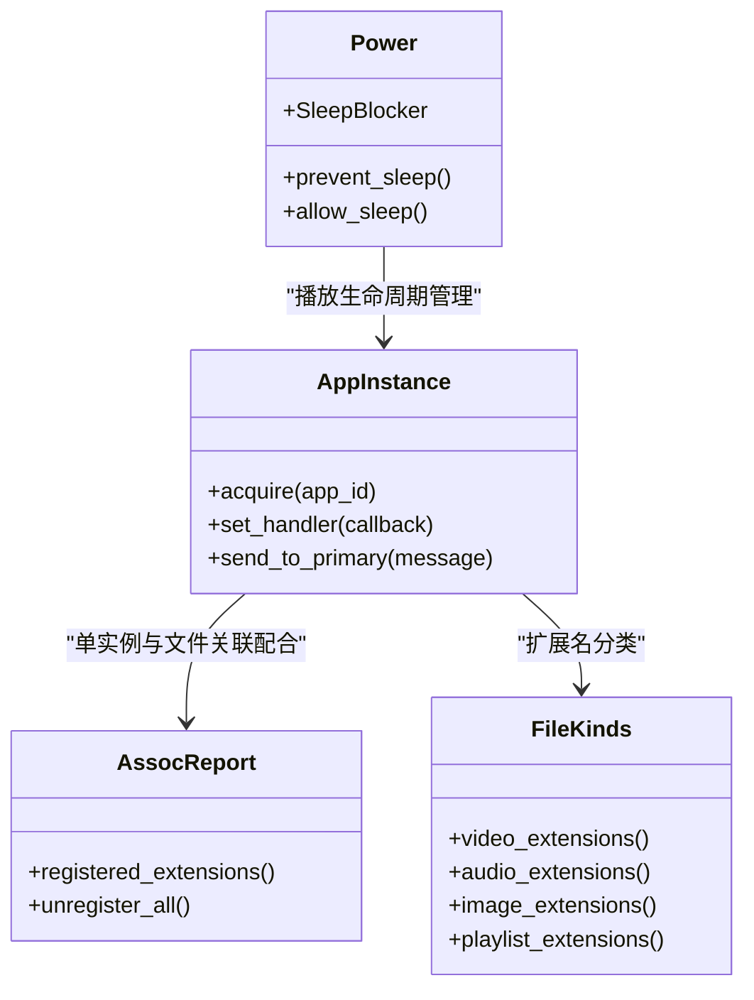

**图表来源**
- [mvp-platform/src/lib.rs:1-34](file://crates/mvp-platform/src/lib.rs#L1-L34)
- [mvp-platform/Cargo.toml:8-47](file://crates/mvp-platform/Cargo.toml#L8-L47)

**章节来源**
- [mvp-platform/src/lib.rs:1-34](file://crates/mvp-platform/src/lib.rs#L1-L34)
- [mvp-platform/Cargo.toml:1-47](file://crates/mvp-platform/Cargo.toml#L1-L47)

### mvp-subtitle：字幕解析
`mvp-subtitle` 是纯逻辑库，不依赖 FFmpeg 或 Windows，因此可以在任意主机上测试，并被媒体信息面板复用。

它负责：
- 解析 SRT、ASS/SSA、WebVTT、MicroDVD。
- 将不同格式统一为 `Cue` 模型。
- 自动识别 UTF-8、UTF-16 BOM、GBK、Big5、Shift_JIS、Windows-1252。
- 提供时间区间查询、相邻片段合并、偏移调整等功能。

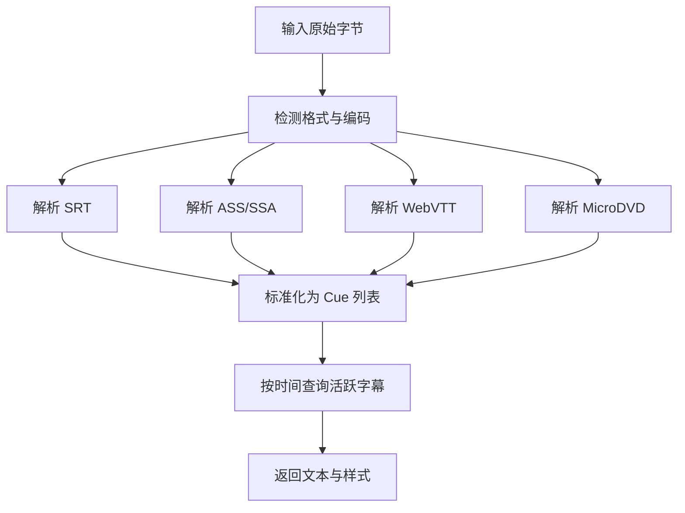

**图表来源**
- [mvp-subtitle/src/lib.rs:1-59](file://crates/mvp-subtitle/src/lib.rs#L1-L59)

**章节来源**
- [mvp-subtitle/src/lib.rs:1-59](file://crates/mvp-subtitle/src/lib.rs#L1-L59)
- [mvp-subtitle/Cargo.toml:1-11](file://crates/mvp-subtitle/Cargo.toml#L1-L11)

### mvp-player：界面与应用入口
`mvp-player` 是最终可执行 crate，负责：
- 命令行解析。
- 单实例互斥体申请与 IPC 消息分发。
- eframe/egui 窗口创建。
- 主题、布局、UI 控件、GL 渲染、设置持久化。
- 调用 `mvp-core` 进行实际播放。

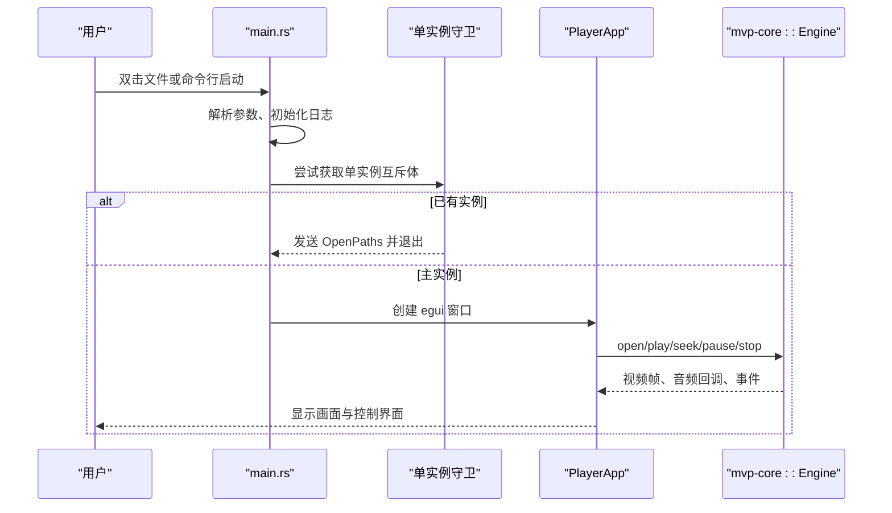

**图表来源**
- [mvp-player/src/main.rs:1-182](file://crates/mvp-player/src/main.rs#L1-L182)
- [mvp-player/Cargo.toml:1-34](file://crates/mvp-player/Cargo.toml#L1-L34)

**章节来源**
- [mvp-player/src/main.rs:1-182](file://crates/mvp-player/src/main.rs#L1-L182)
- [mvp-player/Cargo.toml:1-34](file://crates/mvp-player/Cargo.toml#L1-L34)

## 播放管线与多线程架构
`mvp-core` 的播放管线强调「解复用线程 + 独立解码线程 + 背压队列」：

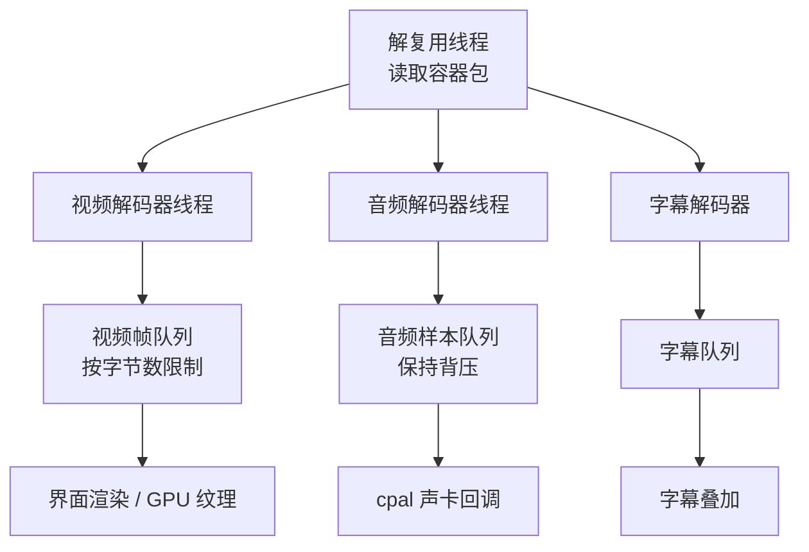

关键设计原则：
- 音视频分别解码，避免慢视频拖垮音频。
- 控制指令不走包队列，跳转与切换音轨通过共享状态下发。
- 队列满时丢弃视频包，但音频保持背压。
- 主时钟使用系统时钟，避免驱动计数器不准导致画面狂奔或冻结。
- 像素只拷贝一次，swscale 写入池化缓冲区后零拷贝交给 GPU。
- 每个工作线程捕获 panic，损坏文件不会带走整个播放器。

**图表来源**
- [README.md:325-357](file://README.md#L325-L357)

**章节来源**
- [README.md:325-357](file://README.md#L325-L357)

## HDR 与杜比视界支持
项目对 HDR 的支持不仅停留在「能播放」，而是尽量把容器元数据与逐帧元数据结合起来：

- 识别 BT.2020 + PQ/HLG。
- 读取容器中的杜比视界配置记录：Profile、Level、单层或双层、兼容层。
- 从 HEVC 解码器附带的 RPU 中提取逐帧参考处理单元。
- 根据兼容层 ID 选择基底层传输函数：PQ 或 HLG。
- 使用 RPU Level 1 的亮度范围瞄准色调曲线。
- 实现重塑曲线（多项式/MMR/NLQ），默认关闭，因为色度部分尚未完全对齐 libplacebo。
- 明确区分「基底层播放」与「增强层合成」，没有增强层样本时不假装支持。

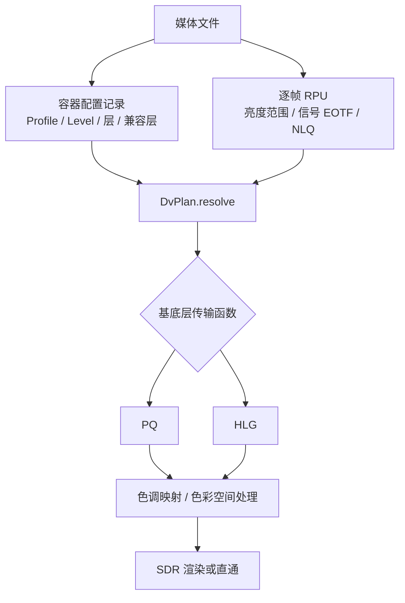

**图表来源**
- [README.md:359-414](file://README.md#L359-L414)

**章节来源**
- [README.md:359-414](file://README.md#L359-L414)

## 音效增强系统
音效增强系统不是简单的音量滑块，而是一条在 cpal 设备回调线程内运行的 DSP 链：

- 十段均衡器：31 Hz – 16 kHz，每段 ±12 dB，预设平直、温暖、明亮、人声、摇滚、低音增强、高音增强、流行、自定义。
- 低音与清晰度：120 Hz 低架 + 二次谐波，6 kHz 高架 + 瞬态增强。
- 响度归一化：K 加权短时电平向目标缓慢逼近。
- 保护：1 ms 前视峰值限制器 + −3 dBFS 软膝，排在链尾。
- 空间感：中侧立体声宽度 + Schroeder 残响，左右声道延迟错开。
- 参数通过无锁 seqlock 发布，回调线程不分配、不加锁、不做 IO。
- 总开关关闭或全部中性值时旁路，保证逐样本与未启用一致。

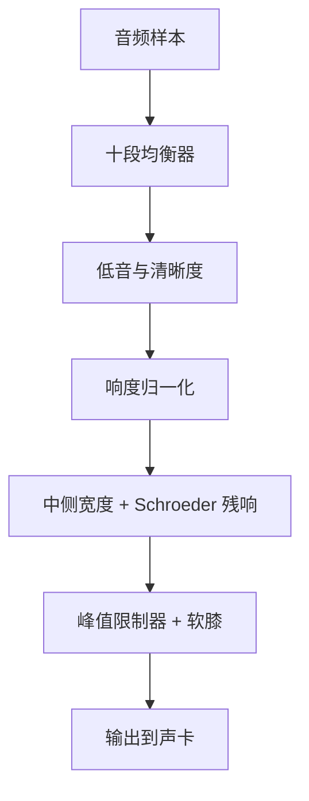

**图表来源**
- [README.md:71-93](file://README.md#L71-L93)

**章节来源**
- [README.md:71-93](file://README.md#L71-L93)

## 字幕与图形字幕
字幕支持分为两类：

1. **文本字幕**：SRT、ASS/SSA、WebVTT、MicroDVD，自动加载同目录字幕，优先匹配中文语言后缀，自动识别多种编码。
2. **图形字幕**：PGS、VobSub、DVB，直接按位图绘制，不需要 OCR，颜色和排版与片源一致。

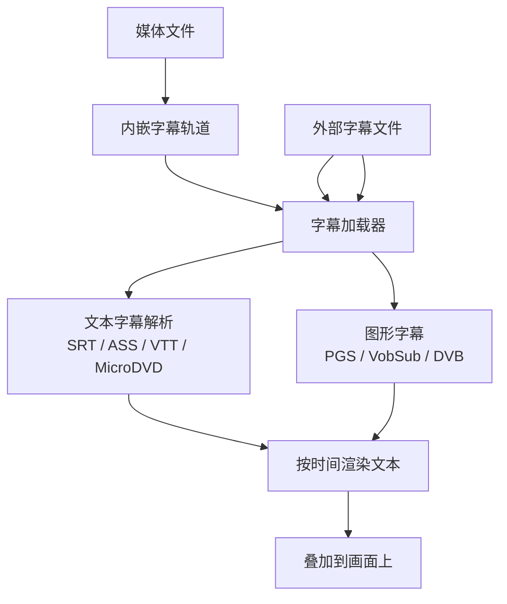

**图表来源**
- [README.md:94-104](file://README.md#L94-L104)
- [mvp-subtitle/src/lib.rs:28-59](file://crates/mvp-subtitle/src/lib.rs#L28-L59)

**章节来源**
- [README.md:94-104](file://README.md#L94-L104)
- [mvp-subtitle/src/lib.rs:1-59](file://crates/mvp-subtitle/src/lib.rs#L1-L59)

## Windows 集成与使用体验
MVP-Versatile-Player 特别注重 Windows 原生体验：

- 资源管理器「打开方式」与右键菜单。
- 一键注册文件关联，仅写入当前用户注册表，无需管理员权限。
- 单实例：再次双击文件会把文件加入现有窗口播放列表并前置窗口。
- 深色标题栏、跟随主题。
- 播放时阻止屏幕/系统休眠。
- 任务栏分组、Jump List、AppUserModelID。

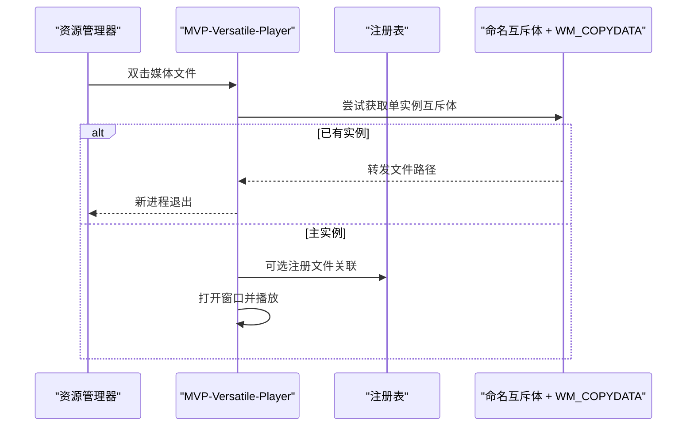

**图表来源**
- [README.md:115-124](file://README.md#L115-L124)
- [mvp-platform/src/lib.rs:1-34](file://crates/mvp-platform/src/lib.rs#L1-L34)
- [mvp-player/src/main.rs:65-99](file://crates/mvp-player/src/main.rs#L65-L99)

**章节来源**
- [README.md:115-124](file://README.md#L115-L124)
- [mvp-platform/src/lib.rs:1-34](file://crates/mvp-platform/src/lib.rs#L1-L34)
- [mvp-player/src/main.rs:65-99](file://crates/mvp-player/src/main.rs#L65-L99)

## 系统要求、依赖与支持的格式

### 系统要求
- 操作系统：Windows。
- Rust：1.85+，目标 `x86_64-pc-windows-msvc`。
- MSVC 生成工具：VS 2022，需要 `link.exe` 与 Windows SDK。
- FFmpeg 开发包：9.0 共享库。
- libclang：任意 15+，用于 `ffmpeg-sys-next` 生成绑定。

**章节来源**
- [README.md:153-162](file://README.md#L153-L162)
- [Cargo.toml:10-13](file://Cargo.toml#L10-L13)

### 依赖关系
- FFmpeg：`ffmpeg-next = "9.0.0"`。
- 音频输出：`cpa l = "0.16"`。
- 图像处理：`image = "0.25"`。
- GUI：`eframe = "0.32"`、`egui = "0.32"`、`rfd = "0.15"`。
- 平台绑定：`windows = "0.62"`。
- 通用工具：`anyhow`、`thiserror`、`log`、`parking_lot`、`crossbeam-channel`、`serde`、`dirs`、`encoding_rs`、`walkdir`、`bytemuck`。

**章节来源**
- [Cargo.toml:17-50](file://Cargo.toml#L17-L50)

### 支持的媒体与文件格式
- 视频/音频：由 FFmpeg 9.0 提供的编解码器与解复用器支持，常见 MP4、MKV、AVI、FLV、TS、HLS、RTMP、RTSP、UDP、RTP、SRT、HTTP/HTTPS 等。
- 图片：PNG、JPEG、GIF、WebP、BMP、TIFF、ICO、TGA、AVIF、JXL、QOI、PNM、EXR。
- 字幕：SRT、ASS、SSA、MOV_TEXT、WebVTT、MicroDVD；图形字幕 PGS、VobSub、DVB。
- 播放列表：`.m3u`、`.pls`、`.xspf`。

**章节来源**
- [README.md:42-114](file://README.md#L42-L114)
- [README.md:266-283](file://README.md#L266-L283)

## 性能与启动优化
项目对启动速度和关闭速度做了大量针对性优化：

- 启动时只做三件事：解析命令行、写一次单实例互斥体、读一个中文字体。
- FFmpeg 表在第一次用到时才初始化，声卡在第一次播放时才打开。
- 发布构建开启 LTO、fat LTO、单 codegen unit、strip symbols，二进制更小更快。
- 关闭时不清理积压数据包，直接 abort 标志丢弃，避免解码线程继续工作。
- 声卡暂停时不再运行输出回调，停止时先标记声卡关闭，避免阻塞等待。
- 设置每 2 秒落盘一次，退出时只写最后一个文档。

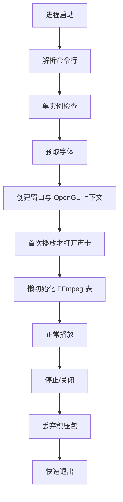

**图表来源**
- [README.md:425-453](file://README.md#L425-L453)
- [mvp-player/src/main.rs:40-182](file://crates/mvp-player/src/main.rs#L40-L182)

**章节来源**
- [README.md:425-453](file://README.md#L425-L453)
- [mvp-player/src/main.rs:40-182](file://crates/mvp-player/src/main.rs#L40-L182)

## 已知限制与下一步工作
项目对限制非常透明，不会假装支持尚未验证的功能：

- 仅支持 Windows。
- 图形字幕坐标基于源字幕画布，VobSub 在分辨率差异较大时有轻微缩放偏差。
- HDR 色调映射是 CPU 上的近似实现，极饱和高光可能有偏差。
- 杜比视界只播基底层，增强层未接通；重塑曲线默认关闭。
- 硬件解码取回画面时仍有显存到内存拷贝，真正零拷贝需把 D3D11 纹理交给渲染器。
- 不支持切换视频轨道，多视频流只解码第一条。
- 不记忆窗口尺寸与位置。
- 视频流的旋转元数据不生效。
- 单帧后退依赖界面保存的画面历史。
- 变速播放极低或极高倍速有轻微调制感。

**章节来源**
- [README.md:548-583](file://README.md#L548-L583)

## 常见问题排查
- 找不到 `libclang`：`ffmpeg-sys-next` 的 bindgen 步骤失败，重新运行 `scripts/setup-ffmpeg.ps1`。
- 找不到 `avcodec.lib` 或 `FFMPEG_DIR` 相关链接错误：FFmpeg 开发包不在预期位置，用脚本指定目录。
- 发布版本没有控制台：日志写入 `%APPDATA%\MVP-Versatile-Player\mvp.log`，超过 2 MB 自动轮转。
- 想查看单个文件的解码流程：使用 `seek_probe` 示例，并可设置 `RUST_LOG=mvp_core=debug`。

**章节来源**
- [README.md:220-231](file://README.md#L220-L231)
- [README.md:435-437](file://README.md#L435-L437)
- [README.md:538-544](file://README.md#L538-L544)
- [mvp-player/src/main.rs:184-294](file://crates/mvp-player/src/main.rs#L184-L294)

## 总结
MVP-Versatile-Player 的技术亮点在于：

1. **直接链接 FFmpeg**：不启动子进程，消除管道预热延迟，提升启动速度与播放响应。
2. **完整的高动态范围支持**：HDR10、BT.2020、PQ/HLG、杜比视界配置记录与 RPU 元数据读取，并明确区分基底层与增强层。
3. **多线程解码架构**：解复用、视频、音频、字幕各自线程，队列按字节数限制，控制指令不排队。
4. **GPU 加速渲染**：画面调节与画质增强走 GPU 着色器，减少 CPU 与显存带宽压力。
5. **专业级音效增强**：十段均衡、响度归一化、峰值限制、空间残响，且关闭时旁路保证零开销。
6. **多格式字幕与图形字幕**：文本字幕统一模型，图形字幕直接位图绘制。
7. **Windows 原生体验**：文件关联、单实例、右键菜单、深色标题栏、阻止休眠。
8. **模块化设计**：`mvp-core`、`mvp-platform`、`mvp-subtitle`、`mvp-player` 职责清晰，便于扩展与维护。

对于初学者，可以从「双击播放、字幕加载、画面调节、截图、全屏」开始；对于开发者，可以从 `mvp-core` 的播放管线、`mvp-platform` 的文件关联与单实例、`mvp-subtitle` 的字幕解析、`mvp-player` 的 egui 界面入手逐步理解整体架构。