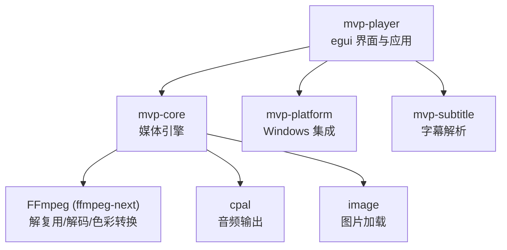
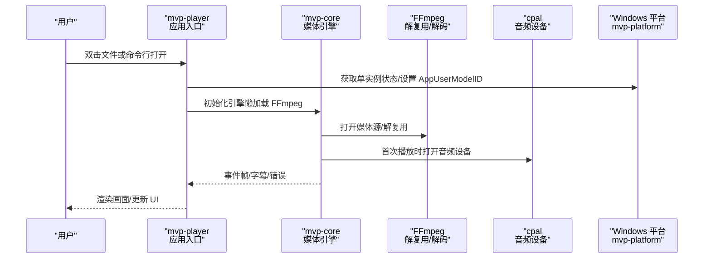
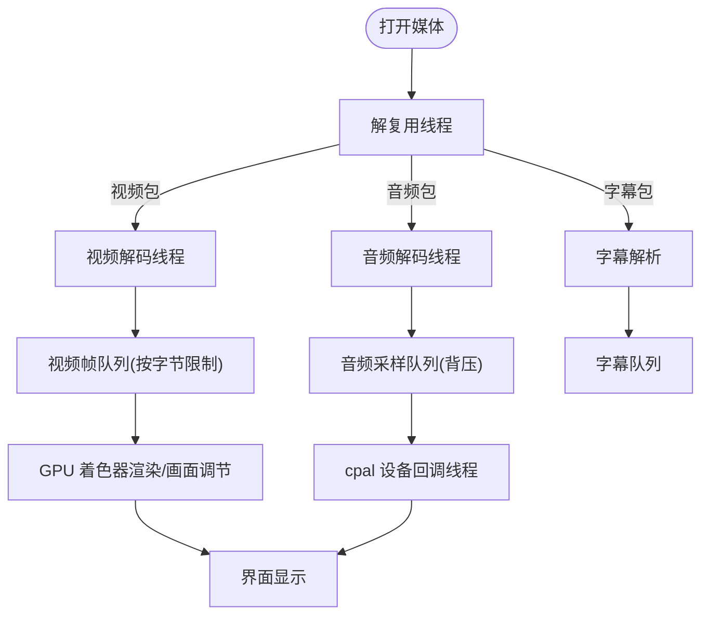
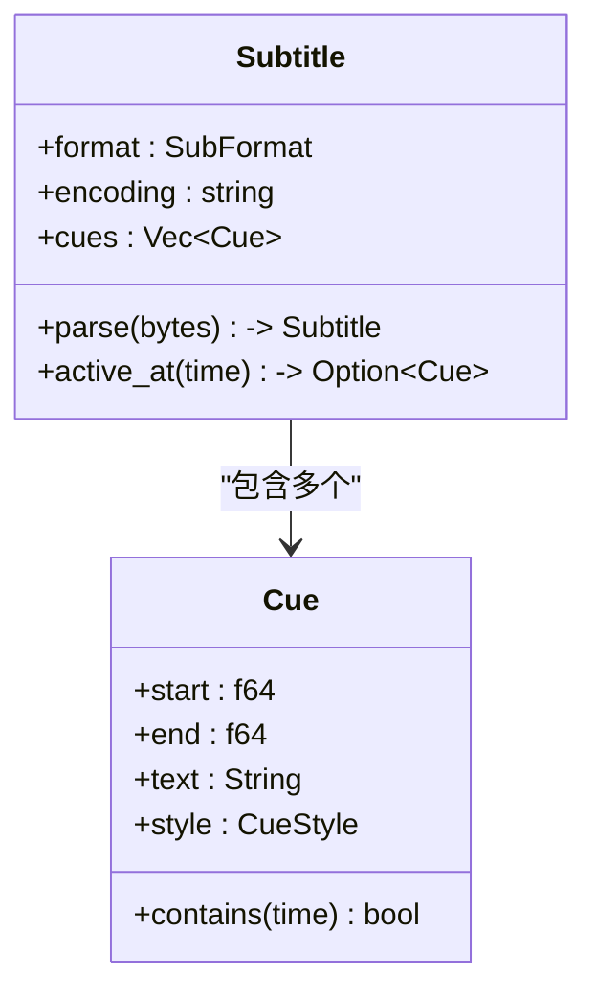
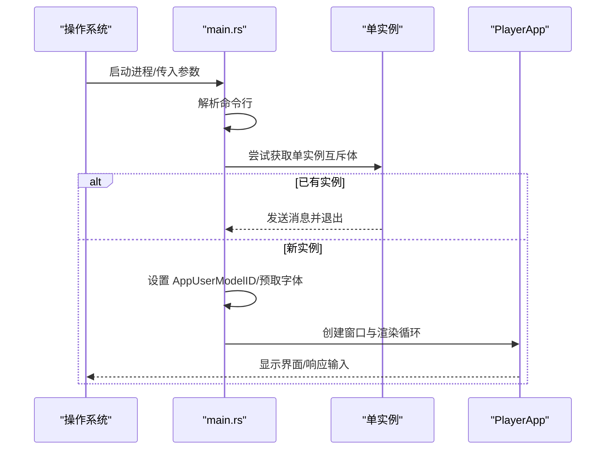
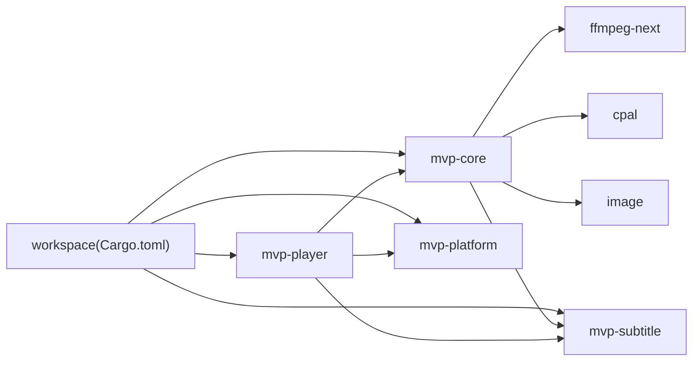

# 项目概述

<cite>
**本文引用的文件**
- [README.md](file://README.md)
- [Cargo.toml](file://Cargo.toml)
- [mvp-core/lib.rs](file://crates/mvp-core/src/lib.rs)
- [mvp-platform/lib.rs](file://crates/mvp-platform/src/lib.rs)
- [mvp-subtitle/lib.rs](file://crates/mvp-subtitle/src/lib.rs)
- [mvp-player/main.rs](file://crates/mvp-player/src/main.rs)
- [调研分析.md](file://docs/02-调研分析.md)
- [用户使用指南.md](file://docs/04-用户使用指南.md)
</cite>

## 目录
1. [简介](#简介)
2. [项目结构](#项目结构)
3. [核心组件](#核心组件)
4. [架构总览](#架构总览)
5. [详细组件分析](#详细组件分析)
6. [依赖关系分析](#依赖关系分析)
7. [性能与特性](#性能与特性)
8. [快速开始](#快速开始)
9. [故障排查](#故障排查)
10. [结论](#结论)

## 简介
MVP-Versatile-Player 是一款面向 Windows 的多功能多媒体播放器，使用 Rust 编写并直接链接 FFmpeg 内核，对标 VLC/PotPlayer 的使用习惯。其核心目标是“开箱即用、中文优先、系统级整合、快与稳”：免安装绿色分发、一键注册文件关联（无需管理员权限）、单实例合并窗口、毫秒级启动与关闭、对 HDR/杜比视界信息的完整识别与提示、多线程解码与 GPU 加速渲染路径等。

技术优势要点：
- 直接链接 FFmpeg，不启动子进程，无管道预热延迟
- 完整的 HDR/杜比视界信息读取与处理策略（基底层播放、RPU 元数据利用）
- 音视频分别解码的线程化管线，控制指令不走队列，避免自死锁
- GPU 加速的画面调节与增强（着色器一次 pass），默认旁路零开销
- 完善的字幕解析（SRT/ASS/VTT/MicroDVD）与编码自动识别（含 GBK）
- 与 Windows 深度集成（文件关联、单实例 IPC、防休眠、深色标题栏等）

**章节来源**
- [README.md:1-610](file://README.md#L1-L610)
- [调研分析.md:134-161](file://docs/02-调研分析.md#L134-L161)

## 项目结构
仓库采用 Cargo workspace 多 crate 组织，职责清晰、边界明确：
- mvp-core：媒体引擎（FFmpeg 绑定、A/V 时钟、播放列表、图片查看模型、HDR/Dolby Vision 处理）
- mvp-platform：Windows 系统集成（文件关联、单实例 IPC、外壳工具、电源管理、显示器工作区）
- mvp-subtitle：字幕解析与时间轴查询（纯逻辑，无平台依赖）
- mvp-player：egui 界面与应用入口（窗口、UI、主题、设置、GL 渲染）

**图表来源**
- [Cargo.toml:1-78](file://Cargo.toml#L1-L78)
- [mvp-player/main.rs:1-526](file://crates/mvp-player/src/main.rs#L1-L526)
- [mvp-core/lib.rs:1-103](file://crates/mvp-core/src/lib.rs#L1-L103)

**章节来源**
- [Cargo.toml:1-78](file://Cargo.toml#L1-L78)
- [README.md:315-323](file://README.md#L315-L323)

## 核心组件
- mvp-core
  - 提供 Engine/Clock/EngineConfig/EngineEvent/EngineSnapshot 等核心 API
  - 暴露视频帧池、RGBA 转换器、图像视图、播放列表、媒体信息等
  - 通过 ffmpeg_next 直接调用 FFmpeg，初始化在首次使用时进行
- mvp-platform
  - 封装文件关联、单实例互斥体与隐藏窗口的 WM_COPYDATA IPC
  - 提供 AppUserModelID、深色标题栏、任务栏闪烁、防休眠等能力
- mvp-subtitle
  - 统一解析 SRT/ASS/SSA/WebVTT/MicroDVD，归一化为 Cue 模型
  - 支持多种编码自动识别（UTF-8/UTF-16/GBK/Big5/Shift_JIS/Windows-1252）
- mvp-player
  - 应用主入口：解析命令行、单实例判定、窗口创建、主题字体预取
  - UI 层：视频/音频/图片三套独立界面，侧边栏、控制栏、设置窗口、截图等

**章节来源**
- [mvp-core/lib.rs:1-103](file://crates/mvp-core/src/lib.rs#L1-L103)
- [mvp-platform/lib.rs:1-34](file://crates/mvp-platform/src/lib.rs#L1-L34)
- [mvp-subtitle/lib.rs:1-201](file://crates/mvp-subtitle/src/lib.rs#L1-L201)
- [mvp-player/main.rs:1-526](file://crates/mvp-player/src/main.rs#L1-L526)

## 架构总览
整体架构遵循“界面—引擎—平台—外部库”的分层设计：
- 界面层（mvp-player）负责用户交互与渲染
- 引擎层（mvp-core）负责媒体解复用、解码、时钟同步、队列与缓冲管理
- 平台层（mvp-platform）负责 Windows 系统集成与系统资源协调
- 外部库（FFmpeg/cpal/image）提供解码、音频输出与图片处理能力

**图表来源**
- [mvp-player/main.rs:40-181](file://crates/mvp-player/src/main.rs#L40-L181)
- [mvp-core/lib.rs:52-69](file://crates/mvp-core/src/lib.rs#L52-L69)

**章节来源**
- [README.md:315-358](file://README.md#L315-L358)
- [mvp-player/main.rs:40-181](file://crates/mvp-player/src/main.rs#L40-L181)

## 详细组件分析

### 媒体引擎（mvp-core）
- 播放管线：解复用线程将包分发给视频/音频/字幕各自解码线程；控制指令（跳转/切换轨道）通过共享状态下发，不走队列，避免阻塞
- 队列与缓冲：所有队列按字节数与帧数双重限制，防止 4K 帧占用过多内存
- 时钟同步：以系统单调时钟为主时钟，避免声卡驱动计数不准导致的漂移
- 色彩与 HDR：根据元数据选择色彩矩阵；HDR 色调映射可按 RPU Level 1 亮度范围瞄准曲线，支持关闭直通原始信号
- 杜比视界：读取容器配置记录与逐帧 RPU，决定传输函数与处理流程；重塑曲线默认关闭，待色度对齐验证后调整

**图表来源**
- [README.md:325-358](file://README.md#L325-L358)

**章节来源**
- [README.md:325-358](file://README.md#L325-L358)
- [mvp-core/lib.rs:1-103](file://crates/mvp-core/src/lib.rs#L1-L103)

### 字幕解析（mvp-subtitle）
- 统一模型：所有格式归一化为 Cue（文本+样式+起止时间）
- 健壮性：解析失败降级为跳过坏块，不 panic；负偏移与越界时间安全处理
- 编码识别：自动检测 UTF-8/UTF-16/GBK/Big5/Shift_JIS/Windows-1252，适配中文外挂字幕常见场景

**图表来源**
- [mvp-subtitle/lib.rs:1-201](file://crates/mvp-subtitle/src/lib.rs#L1-L201)

**章节来源**
- [mvp-subtitle/lib.rs:1-201](file://crates/mvp-subtitle/src/lib.rs#L1-L201)

### 应用入口与界面（mvp-player）
- 启动流程：解析命令行 → 单实例判定 → 设置 AppUserModelID → 预取字体 → 计算窗口尺寸/位置 → 创建 eframe 窗口 → 初始化 PlayerApp
- 日志系统：惰性打开日志文件，超过阈值自动轮转，同时输出到 stderr
- 图标绘制：运行时矢量绘制图标，避免启动时解码 PNG

**图表来源**
- [mvp-player/main.rs:40-181](file://crates/mvp-player/src/main.rs#L40-L181)

**章节来源**
- [mvp-player/main.rs:40-181](file://crates/mvp-player/src/main.rs#L40-L181)
- [mvp-player/main.rs:184-294](file://crates/mvp-player/src/main.rs#L184-L294)

## 依赖关系分析
- 顶层 workspace 声明成员与公共依赖版本
- mvp-core 依赖 ffmpeg-next、cpal、image、mvp-subtitle
- mvp-platform 仅在 Windows target 下启用 windows crate 的功能集
- mvp-player 依赖 eframe/egui/rfd/image，并组合以上三个 crate

**图表来源**
- [Cargo.toml:1-78](file://Cargo.toml#L1-L78)
- [mvp-core/Cargo.toml:1-32](file://crates/mvp-core/Cargo.toml#L1-L32)
- [mvp-platform/Cargo.toml:1-48](file://crates/mvp-platform/Cargo.toml#L1-L48)
- [mvp-player/Cargo.toml:1-38](file://crates/mvp-player/Cargo.toml#L1-L38)

**章节来源**
- [Cargo.toml:1-78](file://Cargo.toml#L1-L78)

## 性能与特性
- 启动速度：自有代码耗时约 6–8 ms；FFmpeg 表与声卡按需初始化
- 关闭速度：关闭即走，不等积压与声卡超时，实测约 46 ms
- 解码与渲染：音视频分别解码，控制指令不走队列；GPU 着色器一次 pass 完成画面调节与增强，默认旁路零开销
- HDR/杜比视界：按元数据选择色彩矩阵；RPU Level 1 亮度范围用于色调曲线瞄准；重塑曲线默认关闭
- 字幕：自动编码识别与语言后缀匹配；图形字幕（PGS/VobSub）无法显示时会明确提示
- 系统集成：免提权文件关联、单实例合并窗口、防休眠、深色标题栏

**章节来源**
- [README.md:425-453](file://README.md#L425-L453)
- [README.md:359-414](file://README.md#L359-L414)
- [README.md:548-583](file://README.md#L548-L583)

## 快速开始
- 环境要求
  - Rust 1.85+（x86_64-pc-windows-msvc）
  - MSVC 生成工具（VS 2022，需 link.exe 与 Windows SDK）
  - FFmpeg 开发包（9.0 共享库）
  - libclang（任意 15+，用于 ffmpeg-sys-next 绑定生成）
- 准备 FFmpeg
  - 运行脚本：`.\scripts\setup-ffmpeg.ps1`
  - 脚本会探测或下载 BtbN 的 FFmpeg 9.0 共享库，定位 libclang，并写入本机 `.cargo/config.toml`
- 构建与运行
  - 开发构建：`.\scripts\dev.ps1 build -p mvp-player`
  - 运行：`.\scripts\dev.ps1 run -p mvp-player`
  - 发布构建：`.\scripts\dev.ps1 build --release -p mvp-player`
  - 测试：`.\scripts\dev.ps1 test --workspace`
- 打包分发
  - `.\scripts\package.ps1` 产物位于 `dist\MVP-Versatile-Player\`，可直接拷贝到其他机器运行

**章节来源**
- [README.md:153-263](file://README.md#L153-L263)

## 故障排查
- 构建失败常见原因
  - 找不到 libclang：重跑 `scripts/setup-ffmpeg.ps1`，确保 LIBCLANG_PATH 正确
  - 找不到 FFmpeg 库：用 `-FfmpegDir <目录>` 指定开发包路径
- 运行问题
  - 日志位置：`%APPDATA%\MVP-Versatile-Player\mvp.log`，超过 2 MB 自动轮转
  - 菜单「帮助 → 查看运行日志」可直接打开
- 已知限制与说明
  - 仅支持 Windows；图形字幕坐标基于源画布；HDR 色调映射为 CPU 近似实现
  - 杜比视界增强层未接通；Profile 5 基底层无法正确还原
  - 硬件解码取回画面时有一次显存→内存拷贝；下一步可考虑 D3D11 纹理直连渲染

**章节来源**
- [README.md:191-231](file://README.md#L191-L231)
- [README.md:425-453](file://README.md#L425-L453)
- [README.md:548-583](file://README.md#L548-L583)

## 结论
MVP-Versatile-Player 以 Rust 与直接链接 FFmpeg 的方式，实现了“快、稳、中文友好、系统级整合”的现代化桌面播放器体验。通过模块化设计（mvp-core、mvp-platform、mvp-subtitle、mvp-player），项目在可测试性、可维护性与扩展性上具备良好基础。对于初学者，可从快速开始与用户使用指南入手；对于有经验的开发者，可深入媒体引擎、HDR/杜比视界处理、GPU 渲染与平台集成等模块，持续优化性能与功能覆盖。